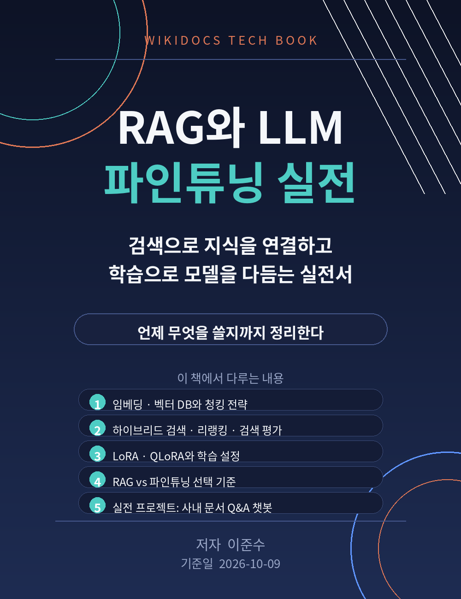

# RAG와 LLM 파인튜닝 실전

검색으로 지식을 연결하고, 학습으로 모델을 다듬는 실전서

저자: 이준수
기준일: 2026-10-09

이 책은 위키독스에서 무료로 읽을 수 있는 공개 도서입니다.
최신 공식 문서는 각 장에 안내된 공식 문서 링크에서 함께 확인하세요.

저장소: https://github.com/1130dlwltn2-sondol/rag-finetuning-practice

문의: 1130dlwltn2@gmail.com
인공지능 정보공유 단톡방 참여 문의: https://open.kakao.com/o/s4OEqBai
