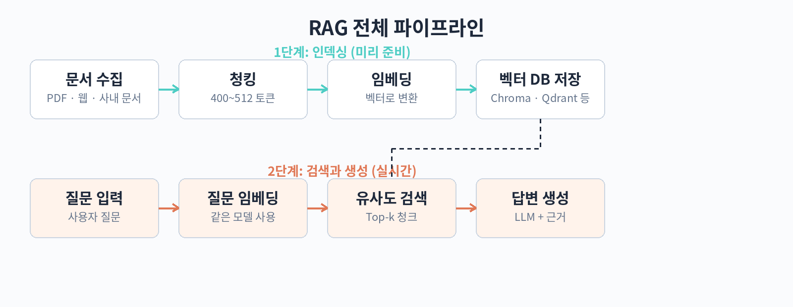

# Part 1. RAG 기초

## 10. RAG란 무엇인가

이 장에서는 RAG(Retrieval-Augmented Generation, 검색 증강 생성)가 왜 등장했는지부터 살펴본다. RAG를 배우기에 앞서, 대형 언어 모델(LLM)이 가진 두 가지 근본적인 한계를 먼저 이해해야 한다. 이 한계를 알아야 RAG가 어떤 문제를 푸는 기술인지 정확히 감을 잡을 수 있다.

### LLM의 한계 1: 지식 마감

LLM은 학습이 끝난 시점 이후의 일을 알지 못한다. 학습 데이터에 포함되지 않은 최신 뉴스, 새로 출시된 제품의 사양, 사내에 새로 도입된 규정 같은 정보는 모델이 애초에 본 적이 없다. 학습이 끝난 날짜를 지식 마감(knowledge cutoff)이라고 부른다.

지식 마감이 문제가 되는 상황은 쉽게 찾을 수 있다. 사내 인사팀에서 "2026년 개정 휴가 규정 알려줘"라고 물으면, LLM은 2026년에 개정된 내용을 학습했을 수도 있고 아닐 수도 있다. 개정 전 규정을 자신 있게 설명해 주면, 그 답변은 틀린 답이 된다. 주식 투자자가 "어제 발표된 실적 발표 내용 요약해 줘"라고 하면, 모델은 어제의 일을 알 수 없으니 그럴듯한 요약을 지어낼 수밖에 없다.

모델을 최신 상태로 유지하기 위해 매번 처음부터 다시 학습시키는 것은 비용이 비현실적이다. 거대 모델을 한 번 학습시키는 데 드는 비용은 수백만 달러 단위다. 결국 지식 마감은 구조적인 한계이며, 학습 방식만으로는 해결하기 어렵다.

### LLM의 한계 2: 환각

환각(hallucination)은 모델이 사실이 아닌 내용을 사실인 것처럼 말하는 현상이다. 존재하지 않는 논문 제목을 인용하고, 없는 법률 조항 번호를 만들고, 가상의 제품 스펙을 자신 있게 설명한다. 말투는 매우 그럴듯해서 구별하기가 어렵다.

환각이 생기는 원인은 LLM의 작동 방식에 있다. LLM은 정답을 저장했다가 꺼내 쓰는 데이터베이스가 아니다. 토큰 단위로 "다음에 나올 가능성이 높은 단어"를 예측하는 모델이다. 이 예측 과정에서는 사실 관계가 직접 검증되지 않는다. 그래서 질문이 구체적일수록, 모델이 확신을 가질수록 오히려 환각이 날 가능성이 커진다.

특히 도메인 지식이 필요한 업무에서는 환각이 치명적이다. 법률 상담에서 없는 판례를 인용하거나, 의료 상담에서 근거 없는 복용법을 안내하면 실제로 피해가 발생한다. 의료나 법률 분야에서는 환각을 허용할 수 없다는 것이 이 책이 반복해서 강조하는 전제다.

### RAG의 개념

RAG는 이 두 가지 한계를 정면으로 푸는 아키텍처다. 핵심 아이디어는 간단하다. 답을 만들 때 모델이 알고 있는 지식에만 의존하지 않고, 외부 문서에서 관련 내용을 검색해 가져온 뒤, 그 내용을 바탕으로 답을 만들게 하는 것이다.

흐름을 단계별로 나누면 다음과 같다.

1. 질문이 들어오면, 먼저 질문과 관련된 문서를 문서 저장소에서 검색한다.
2. 검색된 문서 조각들을 질문과 함께 프롬프트에 붙여 넣는다.
3. LLM은 이 문맥을 읽고, 문맥에 근거해 답변을 생성한다.

이 구조 덕분에 두 가지 효과가 생긴다. 첫째, 문서 저장소만 최신으로 유지하면 지식 마감 문제가 해결된다. 모델을 다시 학습시킬 필요가 없다. 둘째, 답변이 검색된 문서에 근거하므로 환각이 줄어든다. 답의 출처가 되는 문서를 함께 보여줄 수 있어서 사용자는 "이 답이 어디에서 왔는지"를 확인할 수 있다.

RAG의 전체 파이프라인을 도식화하면 아래와 같다.



RAG라는 이름은 "검색으로 생성을 보강한다"는 뜻이다. 검색(retrieval)이 먼저이고 생성(generation)이 뒤에 오는 순서가 중요하다. 검색 없이 생성만 하면 환각이 늘고, 생성 없이 검색만 하면 사용자는 문서 조각 목록만 받아서 직접 읽어야 한다. 둘을 연결하는 것이 RAG의 역할이다.

### RAG가 잘 맞는 경우

RAG는 만능이 아니다. 어떤 문제에 RAG를 쓰는 것이 적절한지 판단하는 것이 이 책의 전체 주제이기도 하다. 먼저 RAG가 특히 효과적인 경우를 정리한다.

첫째, 최신 정보나 비공개 정보를 다뤄야 할 때다. 사내 문서, 고객 지원 문서, 제품 매뉴얼, 연구 노트처럼 모델이 학습한 적 없는 문서를 답의 근거로 삼아야 하는 경우가 대표적이다. 이 경우 문서를 검색해 프롬프트에 넣어 주는 것만으로 지식 마감 문제가 사라진다.

둘째, 답의 출처를 제시해야 할 때다. 검색 결과에서 어떤 문서의 어떤 부분을 근거로 답했는지를 함께 보여주면, 사용자는 답을 검증할 수 있다. 고객 지원 챗봇이나 사내 Q&A처럼 답변의 신뢰도가 중요한 서비스에서는 이 기능이 필수에 가깝다.

셋째, 지식의 업데이트 주기가 짧을 때다. 상품 카탈로그, 요금표, 정책 문서처럼 자주 바뀌는 내용은 모델을 다시 학습시키는 것보다 문서 저장소를 갱신하는 편이 훨씬 저렴하고 빠르다.

반대로 RAG가 잘 맞지 않는 경우도 있다. 창의적인 글쓰기처럼 외부 근거가 필요 없는 작업, 수학 추론처럼 모델 내부의 추론 능력이 핵심인 작업은 RAG 없이도 된다. 또 질문이 매우 애매하거나 검색할 문서를 특정하기 어려운 경우, 검색 단계 자체가 병목이 되어 답변 품질이 떨어진다. 검색 품질을 끌어올리는 방법은 Part 2에서 자세히 다룬다.

### RAG 도입 전 확인할 질문

RAG를 도입하기 전에 아래 질문에 답해 보자. 답이 명확할수록 프로젝트가 순조롭다.

- 어떤 문서가 답의 근거가 되어야 하는가. 문서의 종류와 위치, 갱신 주기를 목록으로 만들 수 있는가.
- 질문의 형태는 어떤가. 짧은 사실 질문이 많은지, 여러 문서를 종합해야 하는 질문이 많은지에 따라 검색 설계가 달라진다.
- 답의 출처를 보여줘야 하는가. 출처 표시가 필요하면 조각마다 메타데이터를 남기는 설계를 처음부터 넣어야 한다.
- 틀린 답이 나왔을 때 누가 책임지는가. RAG는 환각을 줄이지만 없애지는 못한다. 중요한 업무에는 검수 과정을 함께 설계한다.

이 질문들에 답하다 보면 RAG로 풀 문제인지, 다른 방법이 나은지도 자연스럽게 판단된다.

RAG는 기술 선택이기도 하지만 운영 방식의 선택이기도 하다. 문서가 계속 바뀌는 조직이라면 문서를 갱신하는 사람이 RAG 품질의 일부를 책임지게 된다. "문서를 잘 정리하면 챗봇 답변이 좋아진다"는 인식이 퍼지면, 문서 품질 자체가 올라가는 선순환이 생긴다. 반대로 문서 관리가 안 되는 조직에서는 RAG를 도입해도 검색 결과가 엉망이라 효과를 보기 어렵다. 기술 도입 전에 문서 관리 체계를 먼저 점검하는 것이 순서다.

정리하면, RAG는 "모델을 다시 학습시키지 않고 외부 문서를 근거로 답하게 하는" 실용적인 아키텍처다. 다음 장에서는 이 아키텍처의 첫 번째 부품인 임베딩을 더 깊이 파고든다.

### 따라 하기 실습: 키워드로 흉내 내는 미니 RAG

아래 코드는 외부 라이브러리 없이 RAG의 뼈대를 체험하는 예제다. 간단한 키워드 매칭으로 문서를 검색하고, 검색된 문서를 프롬프트에 넣어 답을 만드는 흐름을 따라간다. 실제 서비스에서는 벡터 검색을 쓰지만, 구조는 동일하다.

```python
# documents.py: 사내 문서 몇 건을 준비한다
documents = [
    {"id": 1, "text": "2026년 개정 휴가 규정: 연차는 입사 1년 미만 직원도 월 1일씩 사용할 수 있다."},
    {"id": 2, "text": "2026년 개정 휴가 규정: 연차 수당은 미사용 연차에 대해 통상임금의 100%를 지급한다."},
    {"id": 3, "text": "재택근무 지침: 주 2일까지 재택근무가 가능하며 팀장 승인이 필요하다."},
]

def search(query, docs, top_k=2):
    # 질문의 단어가 포함된 문서를 점수순으로 찾는다 (간이 검색)
    query_words = set(query.split())
    scored = []
    for doc in docs:
        score = len(query_words & set(doc["text"].split()))
        scored.append((score, doc))
    scored.sort(key=lambda x: x[0], reverse=True)
    return [doc for score, doc in scored[:top_k] if score > 0]

def build_prompt(query, retrieved):
    # 검색된 문서를 질문과 함께 프롬프트로 묶는다
    context = "\n".join(f"- {doc['text']}" for doc in retrieved)
    return f"""아래 문서를 근거로 질문에 답하세요.
문서에 없는 내용은 답하지 말고 "문서에서 찾을 수 없습니다"라고 답하세요.

[문서]
{context}

[질문]
{query}

[답변]
"""

def fake_llm(prompt):
    # 실습용: 실제 LLM 호출 대신 프롬프트를 그대로 보여준다
    return prompt

if __name__ == "__main__":
    question = "입사 6개월차 직원의 연차는 며칠인가요?"
    found = search(question, documents)
    prompt = build_prompt(question, found)
    print(fake_llm(prompt))
```

이 코드를 실행하면 검색 단계에서 문서 1번과 2번이 선택되고, 그 내용이 프롬프트의 [문서] 영역에 들어간 것을 확인할 수 있다. 실제 서비스에서는 fake_llm 자리를 OpenAI API나 로컬 모델 호출로 바꾸면 된다. "문서에 없는 내용은 답하지 말라"는 지시가 환각을 억제하는 역할을 한다는 점도 눈여겨보자.

### RAG와 기존 검색의 차이

RAG의 검색 단계는 우리가 평소 쓰는 검색창과 비슷해 보이지만 목적이 다르다. 일반 검색은 사람이 읽을 문서 목록을 보여주는 것이 목표다. 사용자는 검색 결과 10개를 훑어보며 원하는 정보를 직접 찾는다. RAG의 검색은 LLM이 읽을 근거 자료를 모으는 것이 목표다. 사람이 보지 않으므로, 순위가 아니라 "답을 만드는 데 필요한 조각이 빠짐없이 들어있는지"가 중요하다.

이 차이 때문에 RAG에서는 검색 결과를 그대로 보여주지 않는다. 검색된 조각들을 프롬프트에 넣어 LLM이 하나의 답변으로 정리하게 한다. 사용자는 문서 목록이 아니라 완성된 답을 받는다. 다만 답과 함께 출처를 표시하면, 의심스러운 부분은 원문을 직접 확인할 수 있다. 검색과 생성의 장점을 합친 형태라고 보면 된다.

### RAG 용어 정리

RAG를 공부하다 보면 반복해서 등장하는 용어들이 있다. 미리 정리해 두면 이후 장을 읽기가 수월하다.

- 청크(chunk): 검색 단위로 자른 문서 조각. 너무 크면 주제가 희석되고, 너무 작으면 문맥이 부족하다.
- 인덱싱(indexing): 문서 조각을 임베딩 벡터로 바꿔 데이터베이스에 저장하는 준비 작업.
- 리트리버(retriever): 질문을 받아 관련 문서를 찾아주는 검색 부품. 벡터 검색, 키워드 검색, 둘의 조합이 있다.
- 컨텍스트 윈도우(context window): LLM이 한 번에 읽을 수 있는 토큰의 최대량. 검색된 문서는 이 안에 들어가야 한다.
- top-k: 검색 결과 중 상위 k개를 가져온다는 뜻. k가 크면 근거는 풍부해지지만 노이즈도 늘어난다.

### RAG의 한계와 주의점

RAG가 만능이 아니라는 점도 분명히 해 두자. 첫째, 검색 품질이 곧 답변 품질이다. 관련 없는 문서가 검색되면 LLM은 엉뚱한 근거로 답을 만든다. "쓰레기가 들어가면 쓰레기가 나온다"는 원칙이 RAG에도 그대로 적용된다. 검색 품질을 높이는 방법은 Part 2 전체의 주제다.

둘째, 컨텍스트 윈도우에 한계가 있다. 문서를 많이 넣고 싶어도 모델이 한 번에 읽을 수 있는 양에는 상한이 있다. 윈도우가 큰 모델이 나오고 있지만, 길어질수록 비용이 늘고 핵심 정보가 묻히는 현상도 보고되고 있다. 그래서 "많이 넣기"보다 "정확히 넣기"가 중요하다.

셋째, 검색 결과가 없거나 부족하면 환각이 다시 나타난다. "문서에 없으면 모른다고 답하라"는 지시를 넣어도 모델이 이를 완벽히 지키지는 않는다. 특히 질문이 문서의 경계에 걸쳐 있을 때 모델은 부족한 부분을 메우려는 경향이 있다. 이 때문에 답변에 출처를 함께 표시하고, 중요한 업무에서는 사람이 검수하는 과정을 두는 것이 좋다.

### 핵심 정리

- LLM은 지식 마감과 환각이라는 구조적인 한계를 가지고 있으며, 학습 방식만으로는 해결하기 어렵다.
- RAG는 질문과 관련된 문서를 검색해 프롬프트에 넣어 준 뒤 LLM이 그 문맥을 바탕으로 답을 만들게 하는 아키텍처다.
- 문서 저장소만 갱신하면 되므로 지식 업데이트가 빠르고, 답변의 출처를 제시할 수 있어 신뢰도가 높아진다.
- RAG는 최신·비공개 정보를 다루고 답의 근거를 보여줘야 할 때 특히 효과적이며, 창의적 글쓰기나 수학 추론에는 굳이 필요하지 않다.

문의: 1130dlwltn2@gmail.com
인공지능 정보공유 단톡방 참여 문의: https://open.kakao.com/o/s4OEqBai
