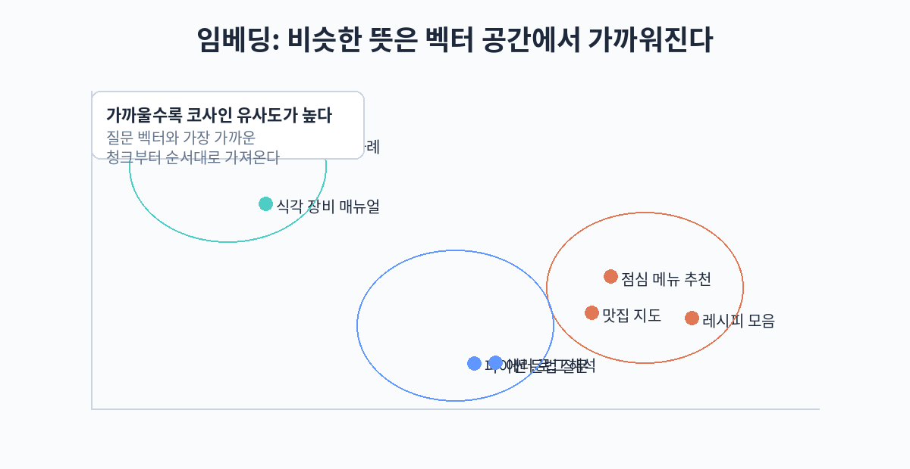

## 11. 임베딩과 벡터의 이해

RAG에서 "관련 문서를 검색"한다는 것은 정확히 무슨 뜻일까. 키워드 매칭만으로는 부족하다. "연차 휴가"와 "휴가 규정"은 단어가 다르지만 의미가 가깝고, "사과"는 과일일 수도 있고 사과문일 수도 있다. 의미를 기준으로 문서와 질문의 거리를 재는 기술이 임베딩(embedding)이다. 이 장에서는 임베딩의 개념과 유사도 측정, 대표 모델들을 살펴본다.

### 임베딩이란 무엇인가

임베딩은 텍스트를 숫자의 나열, 즉 벡터로 바꾸는 것이다. 예를 들어 "사과"라는 단어는 [0.21, -0.53, 0.77, ...] 같은 수백 개에서 수천 개의 실수로 이루어진 벡터로 변환된다. 이렇게 변환된 벡터는 벡터 공간이라는 고차원 좌표계에 배치된다.

핵심 성질은 하나다. 의미가 비슷한 텍스트는 벡터 공간에서 서로 가깝게 배치된다는 것이다. "연차 휴가 신청 방법"과 "휴가 사용 절차 안내"는 표현은 다르지만 의미가 비슷하므로 두 벡터 사이의 거리가 가깝다. 반면 "연차 휴가"와 "주식 투자"는 의미가 멀어 벡터 사이의 거리가 멀다.

이 성질 덕분에 검색은 단순한 수학 계산으로 바뀐다. 질문을 벡터로 바꾸고, 저장된 문서 벡터들과의 거리를 잰 뒤, 가장 가까운 문서 몇 개를 가져오면 된다. 이를 의미 검색(semantic search) 또는 벡터 검색(vector search)이라고 한다.



### 코사인 유사도

벡터 사이의 거리를 재는 가장 흔한 방법이 코사인 유사도(cosine similarity)다. 두 벡터가 가리키는 방향의 각도를 재는 방법인데, 벡터의 길이가 아니라 방향을 비교한다는 점이 특징이다.

수식으로 쓰면 cos(A, B) = (A와 B의 내적) / (A의 길이 곱하기 B의 길이) 이며, 값의 범위는 -1부터 1까지다. 1에 가까울수록 두 벡터가 같은 방향, 즉 의미가 비슷하다는 뜻이다. 0에 가까우면 의미가 무관하고, -1에 가까우면 의미가 정반대다.

왜 방향을 보는 것일까. 텍스트의 길이가 길어지면 벡터의 크기가 커지는 경향이 있는데, 길이 차이 때문에 비슷한 의미의 문장이 멀게 측정되는 것을 막기 위해서다. 방향을 비교하면 긴 문서와 짧은 문서도 의미 기준으로 공정하게 비교할 수 있다.

파이썬으로는 다음과 같이 계산한다. numpy가 있다면 몇 줄로 끝난다.

```python
import numpy as np

def cosine_similarity(a, b):
    # 코사인 유사도를 계산한다
    a = np.array(a)
    b = np.array(b)
    return float(np.dot(a, b) / (np.linalg.norm(a) * np.linalg.norm(b)))

if __name__ == "__main__":
    v1 = [1.0, 0.0, 0.0]
    v2 = [0.9, 0.1, 0.0]
    v3 = [0.0, 1.0, 0.0]
    print(cosine_similarity(v1, v2))  # 1에 가까운 값
    print(cosine_similarity(v1, v3))  # 0에 가까운 값
```

### 대표 임베딩 모델 비교

임베딩 모델은 텍스트를 벡터로 바꿔 주는 모델이다. 아래 표는 2026년 현재 실무에서 자주 쓰이는 대표 모델들을 정리한 것이다. 벡터 차원이 클수록 표현력은 높지만 저장 공간과 계산 비용이 늘어난다.

| 모델 | 제공자 | 벡터 차원 | 특징 |
|---|---|---|---|
| text-embedding-3-small | OpenAI | 1536 | 저비용 고성능. Matryoshka로 차원 축소 가능 |
| text-embedding-3-large | OpenAI | 3072 | 더 높은 정확도. 비용은 small의 약 5배 |
| BGE-m3 | BAAI (오픈소스) | 1024 | 다국어 지원. 한국어 성능이 준수하고 무료로 자체 서빙 가능 |
| nomic-embed-text | Nomic (오픈소스) | 768 | 8192 토큰의 긴 컨텍스트 지원. 로컬 실행에 적합 |
| embed (embed-multilingual) | Cohere | 1024 | 다국어에 강함. API로 제공 |
| all-MiniLM-L6-v2 | sentence-transformers (오픈소스) | 384 | 매우 빠르고 가벼움. 간단한 검색이나 실습에 적합 |

어떤 모델을 고를지는 비용과 정확도의 균형 문제다. 한국어 문서를 다루고 클라우드 API 비용을 피하고 싶다면 BGE-m3가 무난한 출발점이다. 정확도를 최우선으로 하고 비용 부담이 가능하다면 OpenAI의 text-embedding-3-large를 검토한다. 로컬에서 가볍게 실험하고 싶다면 all-MiniLM-L6-v2가 적당하다.

### 같은 모델로 인덱싱과 질의하는 원칙

임베딩 모델 선택에서 가장 중요한 원칙이 하나 있다. 문서를 벡터로 바꾸는(인덱싱) 모델과 질문을 벡터로 바꾸는(질의) 모델은 반드시 같은 모델이어야 한다는 것이다.

이유는 간단하다. 각 임베딩 모델은 자기만의 벡터 공간을 만든다. A 모델로 만든 "연차" 벡터와 B 모델로 만든 "연차" 벡터는 좌표 체계가 완전히 다르다. 같은 단어를 같은 모델로 변환해도 문서용 임베딩과 질문용 임베딩이 다른 모델이면, 거리 계산이 무의미해진다. 두 벡터 공간이 호환되지 않기 때문이다.

따라서 모델을 바꾸기로 했다면 문서 전체를 다시 인덱싱해야 한다. 문서가 수백만 건이라면 이 작업에 시간과 비용이 든다. 처음 모델을 고를 때는 "이 모델과 오래 갈 수 있는가"를 함께 고민하는 것이 좋다.

### Matryoshka 표현

Matryoshka는 임베딩 벡터를 필요에 따라 짧게 자르는 기술이다. 이름은 러시아 인형 마트료시카에서 따왔다. text-embedding-3-small 같은 모델은 처음 1536차원 중 앞부분 일부(예: 512차원)만 써도 성능이 크게 떨어지지 않도록 학습되어 있다.

이게 왜 유용한가. 벡터 차원이 절반이 되면 저장 공간도 절반이 되고, 유사도 계산 속도도 빨라진다. 정확도가 조금 떨어지더라도 속도와 비용이 더 중요한 단계(예: 후보를 많이 뽑는 1차 검색)에서는 짧은 벡터를 쓰고, 최종 정밀도가 필요한 단계에서 긴 벡터를 쓸 수 있다. 모델을 다시 학습시킬 필요 없이 차원을 조절할 수 있다는 점이 Matryoshka의 실용적 가치다.

실제로는 이렇게 쓴다. 전체 문서에 대해 512차원으로 1차 검색을 돌려 후보 100개를 뽑고, 그 100개에 대해서만 1536차원으로 정밀 비교해 상위 5개를 고른다. 저장 공간은 절반으로 줄면서 최종 정확도는 거의 유지된다. 문서가 수백만 건을 넘어가면 이런 2단계 구조가 비용 차이를 크게 만든다.

### 따라 하기 실습: 임베딩과 유사도 계산

sentence-transformers 라이브러리로 실제 임베딩을 만들어 보고 유사도를 계산해 본다. 실행 전에 pip install sentence-transformers numpy를 설치한다.

```python
from sentence_transformers import SentenceTransformer
import numpy as np

def cosine_similarity(a, b):
    # 코사인 유사도를 계산한다
    return float(np.dot(a, b) / (np.linalg.norm(a) * np.linalg.norm(b)))

if __name__ == "__main__":
    # 가볍고 빠른 모델로 임베딩을 생성한다
    model = SentenceTransformer("all-MiniLM-L6-v2")

    docs = [
        "연차 휴가는 입사 1년 미만 직원도 월 1일씩 사용할 수 있다.",
        "재택근무는 주 2일까지 가능하며 팀장 승인이 필요하다.",
        "주식 투자 시 분산 투자를 권장한다.",
    ]
    query = "6개월차 직원이 쉴 수 있는 날이 몇 개인가요?"

    doc_vecs = model.encode(docs)
    query_vec = model.encode(query)

    for i, (doc, vec) in enumerate(zip(docs, doc_vecs)):
        sim = cosine_similarity(query_vec, vec)
        print(f"[{i}] 유사도 {sim:.3f} | {doc}")
```

실행하면 첫 번째 문서(연차 휴가)의 유사도가 가장 높게 나온다. 질문에 "연차"나 "휴가"라는 단어가 없어도 의미가 통해 검색된다는 점이 키워드 검색과의 결정적인 차이다. 이 차이가 바로 RAG가 의미 검색을 쓰는 이유다.

### 벡터 차원과 표현력

벡터 차원은 임베딩 모델이 의미를 표현하는 데 쓰는 숫자의 개수다. 384차원 모델은 텍스트 하나를 384개의 숫자로 표현하고, 3072차원 모델은 3072개의 숫자로 표현한다. 차원이 크면 더 섬세한 의미 차이를 담을 수 있지만, 저장 공간과 계산 비용이 그만큼 늘어난다.

직관적으로 이해해 보자. "사과"라는 단어를 표현한다고 할 때, 2차원으로는 "과일인가, 사과문인가" 정도만 구분할 수 있다. 차원이 늘어나면 "빨간 사과인가, 풋사과인가", "사과 주스인가, 사과 파이인가" 같은 세밀한 차이까지 표현할 수 있다. 하지만 차원을 무한히 늘린다고 성능이 무한히 좋아지지는 않는다. 어느 지점을 넘어서면 성능 향상은 미미해지고 비용만 늘어난다. Matryoshka 같은 기술이 의미 있는 이유가 여기에 있다.

### 한국어 임베딩의 특성

한국어 문서를 다룰 때는 한 가지 더 확인할 것이 있다. 임베딩 모델이 한국어를 얼마나 잘 이해하는지다. 영어 위주로 학습된 모델은 한국어 텍스트의 의미를 제대로 담지 못할 수 있다.

확인 방법은 간단하다. 한국어 질문과 문서 쌍 몇 개를 준비해 유사도를 재어 보는 것이다. 예를 들어 "연차 사용 방법"이라는 질문에 대해 "휴가 신청 절차" 문서의 유사도가 "재택근무 지침" 문서보다 높게 나오는지 확인한다. BGE-m3처럼 다국어로 학습된 모델은 이런 테스트에서 안정적인 결과를 보여주는 편이다.

토크나이저의 영향도 있다. 한국어를 자모 단위로 과도하게 쪼개는 토크나이저를 쓰는 모델은 같은 내용이라도 토큰 수가 늘어나고 의미 표현이 불안정해질 수 있다. 모델을 고를 때는 한국어 벤치마크 결과나 직접 테스트를 함께 보는 것이 좋다.

### 임베딩 품질 확인 방법

임베딩 모델을 바꾸거나 새로 도입할 때는 간단한 평가를 해 보는 것이 좋다. 거창한 벤치마크가 아니어도 된다. 실제 서비스에서 나올 법한 질문 20~30개와, 각 질문에 대한 정답 문서 1~2개를 준비한다. 그리고 각 질문으로 검색했을 때 정답 문서가 상위 k개 안에 들어오는 비율을 잰다. 이를 recall@k라고 한다.

예를 들어 질문 30개 중 27개의 정답 문서가 상위 3개 안에 들어오면 recall@3은 0.9다. 이 숫자를 기준으로 모델을 비교하면 감이 아니라 측정으로 선택할 수 있다. Part 2의 평가 장에서 이 방법을 더 체계적으로 다룬다.

### 임베딩 모델 선택 체크리스트

모델을 고를 때 아래 항목을 순서대로 확인하면 실수를 줄일 수 있다.

1. 한국어 지원 여부: 한국어 문서를 다룬다면 다국어 모델인지, 한국어 평가 결과가 있는지 확인한다.
2. 같은 모델 유지 가능 여부: 문서 인덱싱과 질문 질의에 같은 모델을 계속 쓸 수 있는지 확인한다. API 요금제 변경이나 모델 단종 가능성을 함께 본다.
3. 벡터 차원과 비용: 차원이 클수록 저장 공간과 계산 비용이 늘어난다. Matryoshka 지원 여부도 확인한다.
4. 컨텍스트 길이: 한 번에 임베딩할 수 있는 텍스트 길이. 긴 문서를 통째로 넣을 계획이라면 8192 토큰 이상을 지원하는 모델이 편하다.
5. 운영 방식: 클라우드 API로 쓸지, 오픈소스 모델을 직접 서빙할지 정한다. 보안상 외부 API를 쓸 수 없는 환경이라면 오픈소스 모델이 필수다.

이 다섯 가지를 적어 보고 후보 모델을 비교하면, "유명하니까"가 아니라 우리 조건에 맞는 선택을 할 수 있다.

체크리스트를 다 채웠다면 마지막으로 작은 실험을 돌려 보자. 후보 모델 2~3개로 같은 문서와 질문을 임베딩해 recall@k를 비교한다. 숫자 차이가 크지 않다면 비용이 낮은 쪽을 고른다. 임베딩 모델의 성능 차이는 검색 파이프라인 전체에서 보면 생각보다 작을 때가 많다. 청킹이나 리랭킹 같은 다른 요소가 품질에 더 큰 영향을 주는 경우가 흔하다.

임베딩은 RAG의 출발점이자 검색 품질의 토대다. 다음 장에서는 이 벡터들을 어디에 어떻게 저장하고 찾을지, 벡터 데이터베이스를 살펴본다.

참고로 이 장의 실습 코드는 all-MiniLM-L6-v2를 썼지만, 한국어 문서가 중심이라면 BGE-m3로 바꿔 실행해 보는 것을 권장한다. 모델 이름만 바꾸면 되므로 비교 실험이 간단하다.

### 핵심 정리

- 임베딩은 텍스트를 벡터로 바꾸는 기술이며, 의미가 비슷한 텍스트는 벡터 공간에서 가깝게 배치된다.
- 코사인 유사도는 벡터의 방향을 비교해 의미를 재는 가장 흔한 방법으로, 값이 1에 가까울수록 의미가 비슷하다.
- 모델은 비용과 정확도의 균형으로 고르며, 한국어 문서에는 BGE-m3, 최고 정확도에는 text-embedding-3-large, 가벼운 실험에는 all-MiniLM-L6-v2가 무난하다.
- 문서 인덱싱과 질문 질의는 반드시 같은 임베딩 모델을 써야 하며, 모델을 바꾸면 문서를 다시 인덱싱해야 한다.
- Matryoshka는 벡터 차원을 필요에 따라 짧게 써서 저장 공간과 계산 비용을 아끼는 기술이다.
