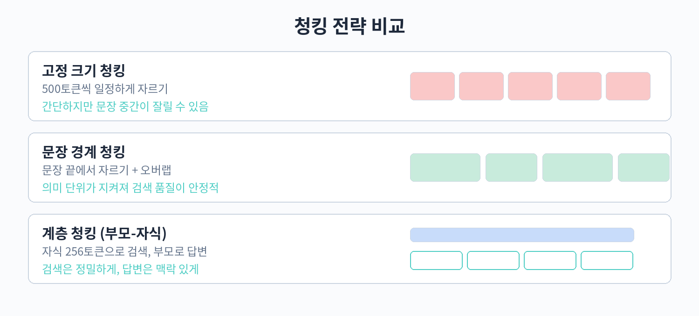

# Part 2. 검색 품질 끌어올리기

## 20. 청킹 전략

Part 1에서 RAG 시스템 전체 흐름을 살펴보았다. 이제부터는 실제 서비스 품질을 좌우하는 검색 품질 향상 기법을 다룬다. Part 2의 출발점은 가장 기초적이면서도 효과가 큰 작업인 청킹이다. 검색이 잘 안 된다는 불만 중 상당수는 모델이나 벡터 DB 문제가 아니라 문서를 나누는 방식이 잘못된 데서 나온다.

### 왜 청킹이 중요한가

청킹(chunking)은 원본 문서를 임베딩하고 검색할 수 있는 단위로 나누는 과정이다. LLM 컨텍스트 윈도우가 수십만 토큰까지 늘어난 시대에도 청킹이 필요한 이유는 세 가지다. 첫째, 임베딩 모델의 입력 길이 제한이다. 많은 임베딩 모델이 512 토큰 전후에서 가장 좋은 품질을 내고, 그 이상이 되면 뒷부분 정보가 뭉개진다. 둘째, 검색 정밀도다. 문서 전체를 하나의 벡터로 만들면 질문과 관련 없는 내용이 노이즈로 섞여 들어가 관련 문서를 찾기 어려워진다. 셋째, LLM 프롬프트 비용과 정보다. 검색 결과로 통째로 긴 문서를 전달하면 비용이 늘고 모델의 집중력이 분산된다.

좋은 청킹은 의미 단위를 유지한다. 검색 결과가 질문에 답하는 데 필요한 정보를 통째로 담고 있어야 하며, 동시에 불필요한 내용은 가능한 적게 담아야 한다. 이 장에서는 대표적인 청킹 전략 네 가지를 비교하고, 실무에서 자주 쓰이는 권장 설정을 정리한다.

### 대표적인 청킹 전략



고정 크기 청킹(fixed-size chunking)은 가장 단순하다. 일정한 문자 수나 토큰 수마다 문서를 자른다. 구현이 쉽고 빠르지만, 문장이나 단락 중간이 잘릴 수 있다는 치명적인 단점이 있다. 의미가 끊긴 청크는 임베딩 품질이 떨어지고, 생성 단계에서 어색한 인용이 나올 수 있다. 간단한 로그나 채팅 기록처럼 문맥 의존성이 낮은 데이터에만 제한적으로 사용한다.

재귀적 청킹(recursive chunking)은 LangChain의 RecursiveCharacterTextSplitter로 유명하다. 문단, 줄바꿈, 문장, 단어, 문자 순으로 구분자를 시도하며 지정 크기에 맞게 나눈다. 문장 경계를 최대한 지키려 하므로 고정 크기보다 품질이 낫다. 별도 설정 없이 적용할 수 있어 기본 선택지로 무난하다. 다만 표, 코드 블록, 목록처럼 특수 구조를 인지하지는 못하므로 문서 성격에 따라 한계가 있다.

의미 기반 청킹(semantic chunking)은 문장 단위로 나눈 뒤 임베딩 유사도가 떨어지는 지점에서 경계를 만든다. 주제가 바뀌는 곳에서 자연스럽게 자르므로 주제 경계가 모호한 에세이나 보고서에 적합하다. 대신 문장마다 임베딩을 계산해야 하므로 청킹 자체의 비용이 크고, 경계 기준(브레이크포인트 임계값)에 따라 결과가 크게 달라진다. 대용량 파이프라인에서는 비용과 시간을 미리 측정해야 한다.

계층적, 또는 부모-자식 청킹(hierarchical/parent-child chunking)은 검색과 생성에 서로 다른 단위를 쓰는 전략이다. 문서는 작게(예: 200 토큰) 자식 청크로 나누어 정밀하게 검색하고, 검색에 걸린 자식 청크의 부모 청크(예: 800 토큰 또는 섹션 전체)를 LLM에 전달한다. 작은 단위로는 검색이 잘 되지만 답을 만들 맥락이 부족하고, 큰 단위로는 검색이 뭉개지는 문제를 동시에 해결한다. 문서에 섹션 구조가 분명할수록 효과가 크다.

### 실무 권장 설정

어떤 전략을 쓰든 다음 원칙은 공통으로 적용된다.

첫째, 청크 크기는 400에서 512 토큰 사이를 권장한다. 임베딩 모델 대부분이 이 구간에서 최적 품질을 내고, 너무 작으면 맥락이 부족해지고 너무 크면 검색 정밀도가 떨어진다. 토큰이 아닌 문자 기준으로 나누는 경우 언어별 토큰 변환율을 고려한다. 한국어는 문자당 토큰이 영어보다 많이 소모되므로, 한국어 문서는 문자 기준 1000~1500자 정도를 시작점으로 삼는 것이 좋다.

둘째, 문장 경계에서 자른다. 문장이 중간에 잘린 청크는 임베딩 모델이 의미 파악에 실패할 확률이 높다. 재귀적 청킹을 쓰거나, 후처리 단계에서 잘린 문장을 복원한다.

셋째, 오버랩(overlap)은 청크 크기의 10에서 20퍼센트를 둔다. 청크 경계에 걸친 문장을 양쪽 청크가 모두 포함하게 하여 검색 누락을 줄인다. 오버랩이 너무 크면 중복 저장과 중복 검색이 늘어나므로 20퍼센트를 넘기지 않는 것이 좋다.

넷째, 메타데이터와 섹션 헤더를 포함한다. 청크에 문서 제목, 섹션 경로(예: 3장 > 3.2절 > 표 3), 페이지 번호 같은 메타데이터를 붙이면 검색 후 필터링과 인용 표시에 활용할 수 있다. 특히 섹션 헤더를 청크 텍스트 앞에 덧붙여 주면(예: "요금제 변경 안내"라는 헤더를 관련 청크마다 포함), 단독으로 떼어 놓아도 의미가 통하는 청크가 된다.

### 따라 하기: 재귀적 청킹과 메타데이터 부여

```python
# pip install langchain-text-splitters tiktoken
from langchain_text_splitters import RecursiveCharacterTextSplitter

# 샘플 문서 (실제로는 PDF, HTML 등에서 추출한 텍스트 사용)
document = """
1. 요금제 변경 안내
고객은 매월 1일부터 말일까지 요금제를 변경할 수 있다.
요금제 변경은 고객센터 앱 또는 홈페이지에서 신청한다.

2. 위약금 정책
약정 기간 내 해지 시 잔여 개월 수에 비례하여 위약금이 부과된다.
위약금은 최대 30만원을 초과하지 않는다.
"""

# 1. 재귀적 청킹: 1000자 단위, 150자 오버랩, 문장 경계 우선
splitter = RecursiveCharacterTextSplitter(
    chunk_size=1000,      # 청크 크기 (한국어 문서 기준 시작점)
    chunk_overlap=150,    # 오버랩: 약 15퍼센트
    separators=["\n\n", "\n", ". ", " ", ""],  # 큰 구분자부터 시도
    length_function=len,
)
chunks = splitter.split_text(document)

# 2. 메타데이터 부여: 섹션 헤더를 함께 저장
metadatas = []
for i, chunk in enumerate(chunks):
    # 섹션 헤더 추출 (실제로는 파서 단계에서 섹션 경로를 기록)
    section = "요금제 변경 안내" if "요금제" in chunk else "위약금 정책"
    metadatas.append({
        "chunk_id": i,
        "section": section,      # 섹션 경로: 검색 필터와 인용에 활용
        "source": "terms.txt",
    })

for meta, chunk in zip(metadatas, chunks):
    print(meta, "->", chunk[:60].replace("\n", " "))
```

부모-자식 청킹은 다음과 같은 구조로 구현한다. 자식 청크에는 부모 청크의 ID를 메타데이터로 연결한다.

```python
# 부모-자식 청킹 개념 구현
parent_splitter = RecursiveCharacterTextSplitter(chunk_size=2000, chunk_overlap=200)
child_splitter = RecursiveCharacterTextSplitter(chunk_size=400, chunk_overlap=60)

parents = parent_splitter.split_text(document)
store = []  # 실제로는 벡터 DB에 저장
for p_id, p_text in enumerate(parents):
    children = child_splitter.split_text(p_text)
    for c_text in children:
        store.append({
            "text": c_text,        # 검색은 자식 청크로
            "parent_id": p_id,     # 생성 시 부모 청크를 함께 전달
        })

# 검색 시나리오: 자식 청크로 top-k 검색 -> parent_id로 부모 청크 조회 -> LLM에 전달
print("부모 청크 수:", len(parents), "| 자식 청크 수:", len(store))
```

### 전략 비교표

| 전략 | 장점 | 단점 | 잘 맞는 문서 |
|---|---|---|---|
| 고정 크기 | 구현이 가장 간단하고 빠름 | 문장 중간이 잘림 | 로그, 채팅 기록 |
| 재귀적 | 문장 경계를 지킴, 기본값으로 무난 | 표와 코드 구조를 모름 | 일반 본문 문서 |
| 의미 기반 | 주제 경계에서 자연스럽게 자름 | 청킹 자체 비용이 큼 | 에세이, 보고서 |
| 부모-자식 | 검색 정밀도와 생성 맥락을 분리 | 구현과 저장이 복잡 | 섹션 구조가 분명한 문서 |

### 의미 기반 청킹 예제

의미 기반 청킹은 문장 임베딩 사이의 유사도가 급격히 떨어지는 지점을 경계로 삼는다. 아래는 개념을 보여주는 단순화된 구현이다. 실제 서비스에서는 langchain의 SemanticChunker를 쓰면 된다.

```python
# pip install sentence-transformers numpy scikit-learn
from sentence_transformers import SentenceTransformer
import numpy as np

sentences = [
    "요금제는 매월 1일부터 말일까지 변경할 수 있다.",
    "변경 신청은 고객센터 앱에서 가능하다.",
    "약정 기간 내 해지 시 위약금이 부과된다.",
    "위약금은 잔여 개월에 비례하여 계산된다.",
    "분실 신고는 24시간 고객센터로 접수한다.",
]
model = SentenceTransformer("sentence-transformers/all-MiniLM-L6-v2")
emb = model.encode(sentences, normalize_embeddings=True)

# 인접 문장 간 코사인 유사도 계산
sims = [float(np.dot(emb[i], emb[i+1])) for i in range(len(emb)-1)]
print("인접 유사도:", [round(s, 3) for s in sims])
# 유사도가 급락하는 지점(예: 평균 - 표준편차 이하)에서 경계를 만든다
threshold = np.mean(sims) - np.std(sims)
chunks, current = [], [sentences[0]]
for i, s in enumerate(sims):
    if s < threshold:
        chunks.append(" ".join(current))
        current = []
    current.append(sentences[i+1])
chunks.append(" ".join(current))
print("청크 수:", len(chunks))
```

위 예제에서 다섯 번째 문장(분실 신고)은 앞의 요금제, 위약금 주제와 달라 경계가 생긴다. 실전에서는 임계값을 데이터에 맞게 조정하고, 청크가 너무 작아지면 병합하는 후처리를 둔다.

### 흔한 실수 세 가지

첫째, 표를 중간에서 자르는 것이다. 표는 행 단위로 의미가 완성되므로, 표가 청크 경계에 걸리면 표 전체를 하나의 청크에 넣거나 최소한 헤더 행을 각 청크에 반복한다. PDF 파서에서 표를 추출할 때는 표 영역을 별도 청크로 분리하는 것이 안전하다.

둘째, 코드 블록을 자르는 것이다. 함수 정의가 둘로 나뉘면 임베딩도 생성도 깨진다. 마크다운 문서라면 코드 펜스 단위로 청크를 나누거나, 코드 블록은 통째로 유지한다.

셋째, 청크 크기를 무작정 키우는 것이다. "컨텍스트가 길면 좋겠지"라는 생각으로 2000 토큰 청크를 쓰면 검색 정밀도가 떨어진다. 23장의 recall@k로 청크 크기를 바꿔가며 측정하고, 숫자로 결정한다.

### 청킹 전략 비교 방법

전략을 바꿀 때마다 감이 아니라 측정으로 판단한다. 방법은 간단하다. 같은 문서 집합에 여러 청킹 설정을 적용해 별도 컬렉션을 만들고, 23장에서 만들 테스트셋으로 recall@5를 비교한다. 이때 검색 쿼리와 임베딩 모델은 고정해야 청킹의 효과만 분리된다. 표본 50개 질문이면 경향 파악에 충분하다. 이 과정을 거치면 "우리 문서에는 재귀적 1000자가 의미 기반보다 낫다" 같은 근거 있는 결론이 나온다.

### 핵심 정리

- 청킹은 검색 품질의 출발점이다. 검색이 안 되는 이유의 상당수는 청킹에 있다.
- 고정 크기는 간단하지만 문장이 잘리고, 재귀적 청킹이 무난한 기본값이며, 의미 기반은 비용이 크고, 부모-자식 구조는 검색과 생성을 분리해 둘 다 잡는다.
- 권장 설정: 400~512 토큰, 문장 경계에서 자르기, 10~20퍼센트 오버랩, 메타데이터와 섹션 헤더 포함.
- 청킹 전략은 문서 종류에 따라 달라진다. 본문 위주 문서, 표가 많은 문서, 코드 문서에 같은 전략을 쓰지 말고 표본으로 테스트한다.
