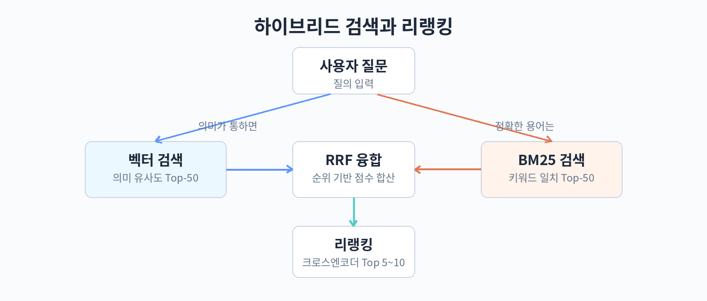

## 21. 하이브리드 검색

앞 장에서 문서를 의미 단위로 나누었다. 다음 문제는 나눈 청크를 어떻게 찾아내는가이다. 벡터 검색 하나만으로는 부족한 경우가 많다. 정확한 키워드가 포함된 문서를 찾지 못하거나, 반대로 의미는 비슷하지만 표현이 다른 문서를 놓치기 때문이다. 이 장에서는 키워드 검색과 벡터 검색을 함께 쓰는 하이브리드 검색을 다룬다.

### BM25 키워드 검색의 원리

BM25는 전통적인 키워드 검색 알고리즘으로, 1970년대 확률적 검색 모델에서 발전했다. 핵심 아이디어는 단순하다. 문서에 질의 단어가 자주 등장할수록, 그 단어가 전체 문서 집합에서 희귀할수록 해당 문서를 높이 평가한다.

BM25 점수는 크게 두 요소로 구성된다. TF(문서 내 단어 빈도)는 단어가 문서에 많이 나올수록 점수가 오르지만, 무한히 오르지 않도록 포화 곡선을 적용한다. 열 번 나온다고 두 번 나온 것의 다섯 배가 되지는 않는 식이다. IDF(역문서 빈도)는 많은 문서에 등장하는 흔한 단어의 가중치를 낮춘다. 예를 들어 "요금제"라는 단어가 전체 문서의 절반에 등장한다면 그 단어의 변별력은 낮다. 여기에 문서 길이 정규화가 더해진다. 긴 문서는 단어가 많이 나올 수밖에 없으므로, 평균 길이 대비 긴 문서는 패널티를 받는다.

벡터 검색이 놓치는 대표적인 경우는 고유명사, 제품 코드, 약어, 오타다. "갤럭시 Z 플립6의 무게"를 찾을 때 벡터 검색은 "폴더블폰 무게" 같은 의미 유사 문서에 끌릴 수 있지만, BM25는 "Z 플립6"이라는 정확한 문자열이 든 문서를 정확히 짚어낸다. 반대로 "휴대폰 무게가 몇 그램이야" 같은 질문에는 벡터 검색이 "갤럭시 Z 플립6 사양표"를 찾아낼 수 있다. 둘은 서로의 빈틈을 메운다.

### 하이브리드 검색 구조



하이브리드 검색의 표준 구조는 병렬 검색 후 융합이다. 하나의 질의가 들어오면 BM25 검색과 벡터 검색을 동시에 실행하고, 각자 상위 후보를 가져온 뒤 하나의 순위로 합친다.

융합 방법 중 가장 널리 쓰이는 것이 RRF(Reciprocal Rank Fusion)이다. 점수 스케일이 전혀 다른 두 검색 결과( BM25 점수와 코사인 유사도)를 직접 합치는 대신, 순위만을 이용해 합친다. 각 문서의 RRF 점수는 검색기마다 1 / (k + 순위)를 합한 값이다. k는 보통 60을 쓴다. 1위를 한 검색기에서 1등을 하고 다른 검색기에서 50등을 한 문서보다, 양쪽에서 10등을 한 문서가 더 높이 올라갈 수도 있다. 즉 여러 검색기에서 고르게 잘 나온 문서를 선호하는 방식이다.

후보 확보 전략도 중요하다. 융합 전에 각 검색기에서 상위 50개 정도의 후보를 넉넉히 가져온다. 하이브리드 검색의 목적은 최종 top-k(예: 5개)에 들어갈 문서를 놓치지 않는 데 있으므로, 중간 단계에서는 재현율을 넓게 잡는다. 이후 장에서 다룰 리랭킹 단계에서 정밀도를 다듬는다. 검색 파이프라인 전체를 "넓게 가져오고, 좁게 추린다"는 흐름으로 이해하면 된다.

### 따라 하기: BM25와 벡터 검색의 병렬 실행과 RRF

```python
# pip install rank-bm25 sentence-transformers numpy
from rank_bm25 import BM25Okapi
from sentence_transformers import SentenceTransformer
import numpy as np

# 샘플 문서 집합
docs = [
    "갤럭시 Z 플립6의 무게는 187g이며 배터리는 4000mAh이다.",
    "폴더블 스마트폰의 평균 무게는 200g 전후로 형성되어 있다.",
    "갤럭시 Z 플립6 스펙: 스냅드래곤 8 Gen 3, 12GB 램.",
    "스마트폰 배터리 용량은 사용 시간에 직접적인 영향을 준다.",
    "갤럭시 Z 플립6 카메라는 5000만 화소 광각을 탑재했다.",
]
query = "Z 플립6 무게 몇 그램?"

# 1. BM25 인덱스 구축 (형태소 분석기 대신 공백 분리; 실전에서는 한국어 형태소 분석 권장)
tokenized = [d.split() for d in docs]
bm25 = BM25Okapi(tokenized)
bm25_scores = bm25.get_scores(query.split())
bm25_rank = np.argsort(-bm25_scores)  # 점수 내림차순 인덱스

# 2. 벡터 검색 (코사인 유사도)
model = SentenceTransformer("sentence-transformers/all-MiniLM-L6-v2")
doc_emb = model.encode(docs, normalize_embeddings=True)
q_emb = model.encode(query, normalize_embeddings=True)
vec_scores = doc_emb @ q_emb
vec_rank = np.argsort(-vec_scores)

# 3. RRF 융합: 각 검색기에서 상위 50개를 가져와 순위로 합산
k = 60
rrf = {}
for rank_list in (bm25_rank[:50], vec_rank[:50]):
    for rank, doc_id in enumerate(rank_list, start=1):
        rrf[doc_id] = rrf.get(doc_id, 0.0) + 1.0 / (k + rank)

fused = sorted(rrf.items(), key=lambda x: -x[1])
print("질의:", query)
for doc_id, score in fused[:3]:
    print(f"RRF {score:.4f} | {docs[doc_id]}")
```

실제 서비스에서는 벡터 DB가 하이브리드 검색을 내장한 경우가 많다. Qdrant, Weaviate, Elasticsearch는 BM25와 벡터 검색을 하나의 쿼리로 실행하고 RRF 융합까지 제공한다. 직접 구현할지 내장 기능을 쓸지는 운영 편의성과 제어 필요성의 균형 문제다. 내장 기능은 구현이 빠르지만 융합 가중치 조정 같은 세밀한 제어가 제한적일 수 있다.

### 융합 방법 비교

RRF 외에도 융합 방법이 있다. 가중합(weighted sum)은 BM25 점수와 벡터 유사도를 각각 0에서 1로 정규화한 뒤 가중치를 곱해 합친다. 예를 들어 벡터 0.7, BM25 0.3처럼 가중치를 두면 어느 쪽을 더 신뢰하는지 조절할 수 있다. 단점은 정규화 방식과 가중치를 데이터에 맞게 튜닝해야 한다는 점이다. 데이터가 바뀌면 다시 튜닝해야 한다.

RRF는 튜닝이 거의 필요 없다는 것이 장점이다. 순위만 쓰므로 점수 스케일 문제를 원천적으로 피한다. 실무에서는 먼저 RRF로 시작하고, 한쪽 검색기의 품질이확연히 떨어지는 경우에만 가중합을 검토하는 순서가 좋다.

정규화 방식도 결과에 영향을 준다. min-max 정규화는 이상치에 민감하므로, 점수 분포가 치우쳐 있다면 z-score 정규화를 시도해 볼 수 있다. 어느 정규화를 쓰든 테스트셋으로 검증한다.

| 융합 방법 | 장점 | 단점 |
|---|---|---|
| RRF | 튜닝 불필요, 스케일 문제 없음 | 검색기별 가중치 조절 불가 |
| 가중합 | 가중치로 신뢰도 조절 가능 | 정규화와 가중치 튜닝 필요 |

### 하이브리드 검색이 오히려 해가 되는 경우

하이브리드 검색이 항상 좋은 것은 아니다. 문서 집합이 특정 도메인 용어로 가득하고 사용자 질문도 같은 용어를 쓴다면, BM25가 엉뚱한 키워드 매칭으로 노이즈를 만들 수 있다. 예를 들어 법률 문서에서 "제3자"라는 단어가 거의 모든 문서에 나오면 IDF가 낮아져 BM25의 변별력이 떨어진다. 이럴 때는 벡터 검색 단독이 더 나을 수 있다. 반대로 제품 카탈로그처럼 정확한 모델명 매칭이 핵심인 데이터에서는 BM25의 비중을 높인다. 융합 비율도 23장의 평가로 정한다.

### 쿼리 전처리: 하이브리드 검색의 짝

검색기 융합만큼 중요한 것이 쿼리 자체의 정제다. 사용자 질문에는 검색에 방해되는 말이 많다. "안녕하세요, 궁금한 게 있는데요" 같은 인사말, "빨리 알려주세요" 같은 요구 표현을 제거하면 BM25의 키워드 매칭이 깨끗해진다. 또한 동의어 확장이 도움이 된다. "휴대폰"을 "스마트폰, 핸드폰"으로 확장하면 키워드 검색의 재현율이 오른다. 동의어 사전은 도메인별로 직접 만드는 것이 가장 정확하다. 벡터 검색은 이런 전처리에 덜 민감하지만, BM25 쪽 품질이 좋아지면 융합 결과 전체가 좋아진다.

### 따라 하기: 가중합 융합과 쿼리 정제

```python
# 가중합 융합 예제 (앞 예제의 bm25_scores, vec_scores를 이어서 사용)
import numpy as np

def minmax(scores):
    lo, hi = scores.min(), scores.max()
    return (scores - lo) / (hi - lo + 1e-9)  # 0~1 정규화

w_vec, w_bm25 = 0.7, 0.3  # 벡터 검색을 더 신뢰하는 경우
fused_scores = w_vec * minmax(vec_scores) + w_bm25 * minmax(bm25_scores)
ranked = np.argsort(-fused_scores)
print("가중합 상위 3개:")
for i in ranked[:3]:
    print(f"점수 {fused_scores[i]:.3f} | {docs[i]}")

# 쿼리 정제: 불용 표현 제거와 동의어 확장
STOP_PHRASES = ["안녕하세요", "궁금한 게 있는데요", "빨리 알려주세요", "알려줘"]
SYNONYMS = {"휴대폰": ["스마트폰", "핸드폰"], "요금제": ["요금 플랜"]}

def refine_query(query):
    for phrase in STOP_PHRASES:
        query = query.replace(phrase, "")
    tokens = query.split()
    expanded = []
    for t in tokens:
        expanded.append(t)
        expanded.extend(SYNONYMS.get(t, []))
    return " ".join(expanded).strip()

print("정제 전:", "안녕하세요, 휴대폰 무게가 궁금한 게 있는데요")
print("정제 후:", refine_query("안녕하세요, 휴대폰 무게가 궁금한 게 있는데요"))
```

### 벡터 DB 내장 하이브리드 검색 활용하기

직접 BM25를 구현하지 않아도 된다. 많은 벡터 DB가 하이브리드 검색을 내장하고 있다. Qdrant는 sparse 벡터와 dense 벡터를 함께 저장하고 쿼리 시점에 융합한다. Weaviate는 BM25와 벡터 검색을 하나의 쿼리로 실행한다. Elasticsearch도 dense_vector 필드와 BM25를 조합한 하이브리드 쿼리를 지원한다.

내장 기능을 쓸 때 확인할 점은 세 가지다. 첫째, 한국어 형태소 분석이 지원되는가. BM25 품질은 토크나이저에 크게 좌우되므로, nori 같은 한국어 분석기를 쓸 수 있는지 확인한다. 둘째, 융합 방식을 조정할 수 있는가. RRF의 k값이나 가중합의 가중치를 바꿀 수 있어야 데이터에 맞게 튜닝할 수 있다. 셋째, 필터와 함께 쓸 수 있는가. 메타데이터 필터(예: 문서 종류가 약관인 것만)와 하이브리드 검색을 조합할 수 있어야 실전에서 쓸모가 있다.

직접 구현과 내장 기능 중 무엇을 고를지는 팀 상황에 달린다. 빠르게 검증하고 싶다면 내장 기능으로 시작하고, 융합 로직을 세밀하게 제어해야 하거나 여러 검색기를 조합해야 한다면 직접 구현한다. 어느 쪽이든 23장의 recall@k로 효과를 측정하는 것은 같다.

### 하이브리드 검색 튜닝 순서

하이브리드 검색을 도입할 때 권장하는 순서는 다음과 같다. 먼저 벡터 검색 단독의 recall@k를 측정해 기준선을 잡는다. 다음으로 BM25 단독의 recall@k를 측정한다. 둘 중 하나가확연히 낮다면 그쪽을 먼저 개선한다. 그 다음 RRF 융합을 적용하고 recall@k가 올랐는지 확인한다. 마지막으로 각 검색기의 후보 수(50개인지 100개인지)와 k값을 바꿔가며 미세 조정한다. 한 번에 여러 설정을 바꾸면 무엇이 효과가 있었는지 알 수 없으므로, 한 번에 하나씩 바꾼다.

측정 결과는 표로 정리해 두면 나중에 같은 결정을 반복하지 않아도 된다. 설정값, recall@k, precision@k, 측정 날짜를 한 줄씩 기록하는 것만으로 충분하다. 파이프라인이 커질수록 이런 기록이 판단의 근거가 된다.

### BM25 파라미터 k1과 b

BM25에는 두 개의 조정 파라미터가 있다. k1은 TF 포화를 조절한다. k1이 크면 단어 빈도의 영향을 오래 받고, 작으면 빨리 포화된다. 기본값은 1.2에서 2.0 사이다. b는 문서 길이 정규화의 강도를 조절한다. b가 1이면 길이 패널티를 완전히 적용하고, 0이면 적용하지 않는다. 기본값은 0.75다.

실무에서는 기본값을 그대로 쓰는 경우가 대부분이다. 문서 길이가 극단적으로 들쭉날쭉한 경우(예: 한 줄짜리 FAQ와 수십 페이지 보고서가 섞인 경우)에만 b를 조정해 본다. 파라미터 튜닝보다 토크나이저 선택이 BM25 품질에 미치는 영향이 훨씬 크므로, 한국어 형태소 분석기 적용을 먼저 챙긴다.

### 핵심 정리

- 벡터 검색은 의미 유사성에 강하고, BM25는 정확한 키워드 매칭에 강하다. 둘을 함께 쓰면 서로의 빈틈을 메운다.
- 표준 구조는 병렬 검색 후 융합이다. 각 검색기에서 상위 50개 정도를 넉넉히 가져와 재현율을 확보한다.
- RRF는 점수 스케일이 다른 검색 결과를 순위 기반으로 합치는 실용적인 융합 방법이다. k=60이 널리 쓰이는 기본값이다.
- 하이브리드 검색은 만능이 아니다. 키워드 검색이 필요 없는 순수 의미 질문 위주 서비스에서는 벡터 검색만으로 충분할 수 있다. 23장에서 다룰 평가로 판단한다.
