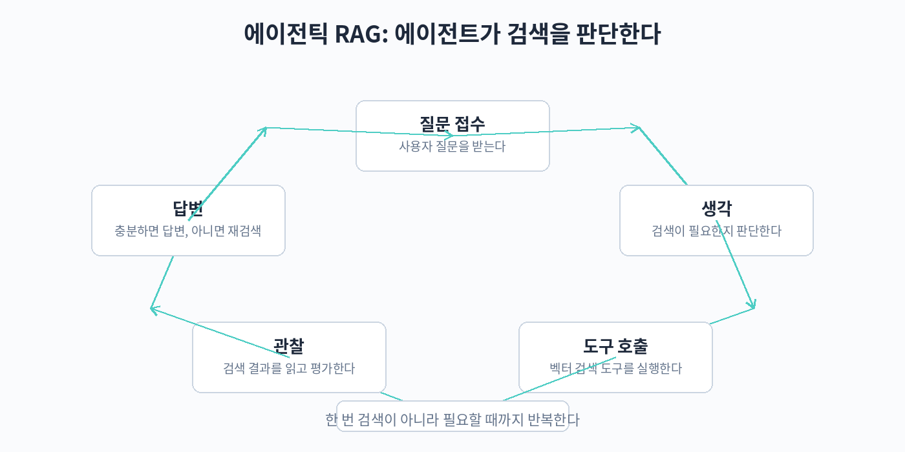

## 24. 에이전틱 RAG

지금까지 다룬 RAG는 정해진 순서대로 움직이는 파이프라인이었다. 질문이 오면 검색하고, 문서를 가져와서, 답변을 만든다. 이 구조는 단순하고 예측 가능하지만, 모든 질문에 같은 양의 검색을 적용한다는 한계가 있다. 어떤 질문은 검색이 필요 없고, 어떤 질문은 여러 번의 검색과 추론이 필요하다. 에이전틱 RAG는 이 판단을 모델 스스로 하게 만드는 접근이다.

### 에이전트가 검색 필요 여부를 판단하는 구조



에이전틱 RAG의 핵심은 검색을 고정 단계가 아니라 도구가 되는 것이다. LLM이 질문을 보고 "내가 이미 아는 내용인가, 검색이 필요한가"를 판단한다. 검색이 필요 없다고 판단하면 바로 답변하고, 필요하면 검색 도구를 호출한다. 검색 결과를 읽고 나서도 한 번에 답을 내지 않는다. 결과가 충분한지 평가하고, 부족하면 검색어를 바꿔 다시 검색하거나 다른 도구를 쓴다. 이 검색-추론 루프를 답을 낼 수 있을 때까지 반복한다.

구체적인 흐름은 다음과 같다. 먼저 라우팅 단계에서 질문을 분류한다. 상식이나 이전 대화 맥락으로 답할 수 있는 질문은 검색 없이 처리한다. 검색이 필요한 질문은 검색 도구를 호출한다. 검색 결과를 받은 뒤에는 평가 단계가 온다. 결과가 질문에 답하기에 충분한가, 서로 모순되지는 않는가를 확인한다. 부족하면 질의를 재작성하거나(예: "위약금"으로 검색했는데 약관 문서가 안 나오면 "약정 해지 위약금 정책"으로 재검색), 하위 질문으로 분해한다(예: "A 제품과 B 제품 중 뭐가 가벼워?"를 두 제품의 무게를 각각 검색하는 질의로 나눈다). 충분해지면 최종 답변을 생성한다.

이 구조가 빛나는 경우는 복잡한 질문이다. "작년에 출시된 폴더블폰 중 가장 가벼운 모델의 배터리 용량은?" 같은 질문은 한 번의 검색으로 답하기 어렵다. 먼저 폴더블폰 목록을 검색하고, 각 모델의 무게를 비교한 뒤, 가장 가벼운 모델의 배터리를 다시 검색해야 한다. 고정 파이프라인에서는 이런 다단계 추론을 처리하기 어렵지만, 에이전틱 구조에서는 루프를 돌며 자연스럽게 해결된다.

### 도구로서의 검색

에이전틱 RAG에서 검색 도구는 단순한 벡터 검색 함수 그 이상이다. 실무에서는 여러 검색 도구를 함께 둔다. 사내 문서 검색, 웹 검색, DB 조회, 계산기 같은 도구를 에이전트가 상황에 맞게 고른다. 예를 들어 "어제 환율" 같은 최신 정보는 웹 검색으로, "우리 회사 휴가 정책"은 사내 문서 검색으로 처리한다.

도구 설계 시 주의할 점이 있다. 도구 설명(tool description)을 명확하게 써야 에이전트가 올바른 도구를 고른다. "사내 인사 규정을 검색한다"와 "인터넷의 일반 정보를 검색한다"처럼 경계가 분명해야 한다. 또한 도구의 출력은 에이전트가 읽기 좋은 형태로 다듬는다. 너무 긴 원문을 그대로 던지면 컨텍스트를 낭비하고 판단이 흐려지므로, 검색 결과는 요약이나 핵심 발췌 형태로 전달하는 것이 좋다.

### 따라 하기: 검색-추론 루프의 간단한 구현

```python
# 에이전틱 RAG의 핵심 루프를 단순화한 예제
# 실제로는 LangChain, LlamaIndex의 에이전트 기능을 사용 권장

def search_tool(query):
    # 사내 문서 검색 (하이브리드 검색 + 리랭킹 파이프라인이라고 가정)
    return fake_search(query)  # ["관련 문서1", "관련 문서2"] 형태 반환

def llm_decide(question, history):
    # LLM이 다음 행동을 판단: "검색 필요", "답변 가능" 중 하나를 반환
    # 실제로는 function calling이나 ReAct 프롬프트 사용
    return fake_llm_decision(question, history)

def llm_answer(question, evidence):
    # 수집된 근거를 바탕으로 최종 답변 생성
    return fake_llm_generate(question, evidence)

def agentic_rag(question, max_steps=5):
    evidence = []   # 수집된 검색 결과
    history = []    # 지금까지의 판단 기록

    for step in range(max_steps):
        decision = llm_decide(question, history)

        if decision["action"] == "answer":
            # 검색이 충분하다고 판단하면 답변 생성
            return llm_answer(question, evidence)

        if decision["action"] == "search":
            # 검색어를 재작성하거나 하위 질의로 분해한 뒤 검색
            results = search_tool(decision["query"])
            evidence.extend(results)
            history.append(f"검색: {decision['query']} -> {len(results)}건 확보")

    # 최대 단계 도달 시 지금까지의 근거로 답변
    return llm_answer(question, evidence)

# 사용 예시
# result = agentic_rag("작년 출시 폴더블폰 중 가장 가벼운 모델의 배터리는?")
# 에이전트는 "폴더블폰 목록 검색" -> "각 모델 무게 비교" -> "최경량 모델 배터리 검색" 순으로 루프를 돈다
```

위 코드는 개념을 보여주기 위한 뼈대다. 실제 구현에서는 LLM의 판단 부분을 ReAct 프롬프트나 function calling으로 만든다. ReAct는 "생각(Thought) - 행동(Action) - 관찰(Observation)"을 반복하는 프롬프트 패턴으로, 추가 라이브러리 없이 구현할 수 있다. Function calling은 모델이 구조화된 형태로 도구 호출을 반환하게 하는 방식으로, 판단의 안정성이 높다.

### 언제 에이전틱 구조를 도입하는가

에이전틱 RAG는 만능이 아니다. 비용과 복잡도가 크게 늘어난다. LLM 호출이 여러 번 발생하므로 지연 시간과 비용이 고정 파이프라인의 수 배가 될 수 있고, 루프가 예상과 다르게 도는 경우 디버깅도 어렵다. 따라서 도입 기준을 명확히 하는 것이 좋다.

단순한 질의응답 서비스라면 고정 파이프라인으로 충분하다. 질문이 하나의 문서로 답할 수 있는 형태가 대부분이라면 에이전트의 판단은 오버헤드일 뿐이다. 반면 질문이 복잡하고 다양해서 "몇 번 검색해야 할지"를 미리 정하기 어렵다면, 에이전틱 구조를 검토한다. 실무적인 접근은 하이브리드다. 먼저 라우터만 두어 "검색이 필요한 질문"과 "아닌 질문"을 구분하고, 복잡한 질문에만 전체 루프를 적용하는 식으로 단계적으로 확장한다.

또한 에이전트의 판단 품질을 평가해야 한다. 불필요한 검색을 남발하지 않는지, 필요한 검색을 빼먹지 않는지를 로그로 기록하고, 23장의 평가 방법과 연결한다. 특히 검색 없이 답한 경우의 faithfulness를 별도로 추적하면, 에이전트가 검색을 건너뛰어도 되는 질문을 올바르게 구분하는지 확인할 수 있다.

### ReAct 프롬프트 패턴

에이전트의 판단 부분을 가장 간단하게 구현하는 방법은 ReAct 프롬프트다. 모델에게 생각(Thought), 행동(Action), 관찰(Observation)을 반복하라고 지시한다. 추가 라이브러리 없이 프롬프트만으로 에이전트처럼 동작시킬 수 있다.

```
당신은 사내 문서 검색 도구를 사용할 수 있는 어시스턴트입니다.
다음 형식을 엄격히 지켜 답변하세요.

Thought: 지금 무엇을 해야 하는지 한 문장으로 판단합니다.
Action: search["검색어"] 또는 answer 중 하나를 선택합니다.
Observation: (Action이 search였다면) 검색 결과가 여기에 들어갑니다.

질문: 약정 기간 중 해지하면 위약금이 얼마인가요?
Thought: 약관 문서에서 위약금 정책을 찾아야 한다.
Action: search["약정 해지 위약금 정책"]
```

모델이 search를 반환하면 실제로 검색 도구를 실행하고, 결과를 Observation으로 넣어 다시 모델을 호출한다. answer를 반환하면 최종 답변을 생성한다. 이 루프를 최대 단계까지 반복한다. 단순하지만 디버깅이 쉽고 동작을 예측하기 좋다는 장점이 있다.

### 라우터부터 시작하는 단계적 도입

에이전틱 구조를 한 번에 도입하기 부담스럽다면 라우터부터 시작한다. 라우터는 질문을 보고 검색이 필요한지 아닌지만 판단하는 가벼운 분류기다.

```python
# 라우터: 검색 필요 여부를 먼저 판단하는 간단한 분류
def route(question):
    # 실제로는 작은 LLM 호출이나 분류 모델 사용
    no_search_keywords = ["안녕", "고마워", "너는 누구야"]
    if any(k in question for k in no_search_keywords):
        return "direct"   # 검색 없이 바로 답변
    return "search"       # 검색 파이프라인으로 전달

questions = ["안녕하세요", "위약금이 얼마인가요?"]
for q in questions:
    print(q, "->", route(q))
```

라우터만으로도 효과가 크다. 인사나 잡담 같은 질문에 불필요한 검색을 하지 않으므로 비용과 지연 시간이 줄고, 검색이 필요한 질문은 기존 파이프라인이 처리하므로 안정적이다. 라우터가 안정화된 뒤에 복잡한 질문에만 전체 검색-추론 루프를 적용하는 식으로 확장한다.

### 에이전트의 실패 모드와 가드레일

에이전틱 구조에는 고정 파이프라인에 없는 실패 모드가 있다.

- 무한 루프: 검색 결과가 계속 부족하다고 판단해 루프가 끝나지 않는다. 최대 단계(max_steps)를 정하고, 도달하면 지금까지의 근거로 답변하게 한다.
- 도구 오선택: 사내 문서로 답할 질문을 웹 검색으로 처리한다. 도구 설명을 명확히 쓰고, 도메인별 라우팅 규칙을 둔다.
- 검색어 표류: 재검색을 반복하며 원래 질문과 멀어진다. 원래 질문과의 관련성을 주기적으로 확인하거나, 재작성된 검색어에 원래 핵심 키워드를 유지하게 한다.
- 비용 폭증: 한 질문에 수십 번의 LLM 호출이 발생한다. 질문당 최대 호출 횟수와 토큰 예산을 정하고 초과 시 중단한다.

이러한 가드레일은 처음부터 넣는다. 에이전트가 똑똑해 보여도 통제는 파이프라인 설계자의 몫이다.

### 에이전트 행동 평가하기

에이전트를 도입했다면 그 행동 자체를 평가해야 한다. 볼 지표는 세 가지다.

- 검색 적중률: 에이전트가 호출한 검색 중 실제로 답변에 쓰인 비율이다. 낮으면 불필요한 검색이 많다는 뜻이다.
- 검색 생략 정확도: 검색 없이 답한 경우 중 답이 맞았던 비율이다. 검색이 필요했는데 건너뛴 경우가 있는지 본다.
- 평균 단계 수: 질문당 평균 루프 횟수다. 갑자기 늘어나면 프롬프트나 도구 설명에 문제가 생긴 신호다.

이 지표들은 로그에서 계산할 수 있다. 매 루프마다 행동(action), 검색어, 검색 결과 수, 최종 답변을 기록해 두면 된다. 23장의 테스트셋에 복잡한 질문 유형을 추가하면 에이전트 평가용으로도 쓸 수 있다.

### Function calling 방식과의 비교

ReAct는 프롬프트만으로 구현할 수 있지만, 모델이 형식을 어기면 파싱이 깨진다. Function calling(도구 호출)은 모델이 구조화된 JSON 형태로 도구 호출을 반환하게 하는 방식으로, 최신 모델들이 네이티브로 지원한다. 판단의 안정성이 높아 실전에서는 function calling을 쓰는 경우가 많다.

```python
# Function calling 개념 예제 (OpenAI 스타일 도구 정의)
tools = [
    {
        "name": "search_docs",
        "description": "사내 문서에서 관련 내용을 검색한다. 약관, 정책 문서 검색에 사용한다.",
        "parameters": {
            "query": "검색어. 원래 질문의 핵심 키워드를 유지하며 구체적으로 작성한다.",
        },
    },
    {
        "name": "search_web",
        "description": "인터넷에서 최신 일반 정보를 검색한다. 출시일, 환율 같은 최신 정보에 사용한다.",
        "parameters": {
            "query": "검색어",
        },
    },
]
# 모델은 질문을 보고 search_docs와 search_web 중 어느 것을 호출할지 JSON으로 반환한다
# 도구 설명이 명확할수록 올바른 도구를 고를 확률이 높아진다
print("등록된 도구:", [t["name"] for t in tools])
```

도구 설명(description) 작성 요령은 세 가지다. 첫째, 언제 쓰는지를 명시한다. "약관, 정책 문서 검색에 사용"처럼 경계를 분명히 한다. 둘째, 언제 쓰지 말지를 적는다. "최신 뉴스에는 search_web을 쓴다"처럼 혼동 지점을 미리 막는다. 셋째, 입력 형식을 구체적으로 적는다. "원래 질문의 핵심 키워드를 유지"하라고 하면 검색어 표류를 줄일 수 있다.

### 프레임워크를 쓸 때와 직접 만들 때

LangChain과 LlamaIndex는 에이전트 기능을 내장하고 있다. 도구 등록, 루프 실행, 대화 기록 관리를 프레임워크가 대신하므로 빠르게 만들 수 있다. 반면 직접 구현하면 동작을 완전히 통제할 수 있고 의존성이 줄어든다. 선택 기준은 단순하다. 에이전트 구조를 실험하는 단계라면 프레임워크로 빠르게 검증하고, 운영 단계에서 특정 동작(예: 루프 중단 조건, 로깅 형식)을 세밀하게 제어해야 한다면 필요한 부분만 직접 만든다. 어느 쪽이든 가드레일과 평가 지표는 직접 챙겨야 한다. 프레임워크가 자동으로 해주지 않는다.

### 핵심 정리

- 에이전틱 RAG는 검색을 고정 단계가 아니라 도구에 둔다. 모델이 검색 필요 여부를 판단하고 검색-추론 루프를 돈다.
- 다단계 추론이 필요한 복잡한 질문에서 강점을 보인다. 질의 재작성과 하위 질문 분해가 핵심 동작이다.
- 도구 설명을 명확히 쓰고, 도구 출력은 에이전트가 읽기 좋게 다듬는다.
- 비용과 지연 시간이 크므로 무조건 도입하지 않는다. 단순 질의응답은 고정 파이프라인으로, 복잡한 질문에만 단계적으로 적용한다.
