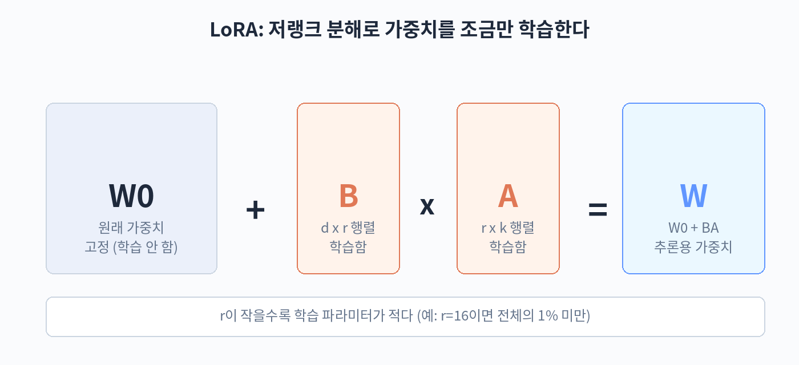

## 32. LoRA와 QLoRA

90억 개 파라미터짜리 모델을 통째로 학습시키려면 수십 GB의 GPU 메모리가 필요하다. 일반인이 가진 GPU 한 장으로는 불가능에 가까운 일이었다. LoRA는 이 문제를 해결한 방법으로, 오늘날 파인튜닝 실무의 사실상 표준이 되었다. 이 장에서는 LoRA의 원리와 설정, 그리고 더 적은 메모리로 학습하는 QLoRA를 다룬다.



### 저랭크 분해의 원리

LoRA(Low-Rank Adaptation)의 아이디어는 단순하다. 가중치 행렬 W를 직접 업데이트하는 대신, 변화량만을 저랭크(low-rank) 행렬 두 개의 곱으로 표현한다.

수식으로 쓰면 다음과 같다. 원래 가중치를 W0이라고 할 때, 학습 후 가중치는 W = W0 + BA 가 된다. 여기서 B와 A는 작은 행렬이다. W0이 d 곱하기 k 크기라면, B는 d 곱하기 r, A는 r 곱하기 k 크기이며, r은 rank라고 부르는 작은 수(보통 8~64)이다.

핵심은 학습 중에 W0는 얼리고(freeze), B와 A만 학습한다는 점이다. 예를 들어 d와 k가 각각 4096이고 r이 16이라면, 원래 1,677만 개의 파라미터를 업데이트해야 할 자리에 약 13만 개만 학습하면 된다. 100분의 1 이하로 줄어드는 셈이다. 학습이 끝나면 BA를 W0에 더해 하나의 행렬로 합칠 수 있어, 추론 시 추가 연산 비용이 들지 않는다.

왜 이렇게 작은 행렬로도 충분할까. 사전 학습된 모델의 가중치 변화는 실제로는 낮은 차원의 부분 공간에 머무른다는 관찰 때문이다. 큰 모델이 이미 언어 능력을 갖추고 있으므로, 특정 작업에 적응하는 데 필요한 조정은 생각보다 작은 자유도로 표현된다.

### r, alpha, target modules 설정

LoRA를 쓸 때 정해야 하는 주요 하이퍼파라미터는 세 가지이다.

r(rank)은 저랭크 행렬의 차원이다. 값이 클수록 표현력이 좋아지지만 학습할 파라미터도 늘어난다. 일반적인 인스트럭션 튜닝에서는 16 정도가 무난한 출발점이다. 작업이 복잡하거나 데이터가 많으면 32나 64를 시도해 본다.

alpha는 스케일링 계수이다. 실제 가중치에 더해지는 값은 (alpha 나누기 r) 곱하기 BA 이다. r을 바꿔도 학습의 크기가 일정하게 유지되도록 alpha를 r의 2배로 두는 관행이 널리 쓰인다. 예를 들어 r이 16이면 alpha는 32이다.

target modules는 LoRA를 적용할 레이어를 지정한다. 트랜스포머의 어텐션 가중치(q_proj, v_proj 등)와 MLP 가중치에 적용하는 것이 일반적이다. 처음에는 q_proj와 v_proj에만 적용하는 방식이 제안되었지만, 요즘은 모든 선형 레이어에 적용하는 편이 성능이 좋다는 경험이 많다. PEFT 라이브러리에서는 target modules를 리스트로 지정한다.

드롭아웃(dropout)도 설정할 수 있다. LoRA 행렬에 적용하는 드롭아웃으로, 보통 0.05 정도를 쓴다. 데이터가 적을 때 과적합을 막는 데 도움이 된다.

### QLoRA: 4비트 양자화로 메모리 절약

QLoRA는 LoRA에 양자화(quantization)를 결합한 방법이다. 모델의 원래 가중치 W0를 4비트 정밀도로 메모리에 올리고, 학습은 LoRA 행렬(B, A)만 16비트나 32비트로 수행한다. 4비트 양자화에는 NF4(NormalFloat 4-bit)라는 형식이 쓰이는데, 정규분포를 따르는 가중치 값에 맞게 설계되어 정보 손실이 적다.

효과는 극적이다. 90억 파라미터 모델을 16비트(bfloat16)로 올리면 가중치만 약 18GB가 필요하지만, 4비트로 양자화하면 약 4.5GB로 줄어든다. 덕분에 메모리 16GB짜리 GPU 한 장으로도 9B급 모델의 파인튜닝이 가능해진다. 학습 속도는 양자화·역양자화 오버헤드 때문에 다소 느려지지만, 개인이나 작은 팀이 파인튜닝에 접근할 수 있게 된 것은 QLoRA 덕분이다.

QLoRA를 쓸 때 주의할 점도 있다. 양자화된 가중치는 학습 중에 변하지 않으므로, 4비트 정밀도의 오차가 결과에 영향을 줄 수 있다. 대부분의 경우 성능 저하는 미미하지만, 수학 추론처럼 정밀도가 중요한 작업에서는 16비트 LoRA와 비교해 보는 것이 좋다.

### 관련 방법: DoRA와 IA3

LoRA의 변형들도 알아두면 좋다. DoRA(Weight-Decomposed Low-Rank Adaptation)는 가중치를 크기와 방향으로 분해한 뒤 방향에만 LoRA를 적용하는 방법이다. 전체 파인튜닝의 학습 동작과 더 비슷해지면서도 파라미터 효율성은 유지한다. 학습 비용은 LoRA보다 조금 더 든다.

IA3는 어텐션의 key, value와 MLP 활성화에 작은 스케일 벡터를 곱하는 방식이다. 학습 파라미터가 LoRA보다도 적어 매우 가볍지만, 표현력이 제한적이라 간단한 스타일 적응 정도에 적합하다. 실무에서는 LoRA와 QLoRA가 주류이고, DoRA는 성능을 조금 더 끌어올리고 싶을 때 고려하는 정도이다.

### r과 alpha 고르기: 실험 가이드

r을 정하는 데 정답은 없지만, 실무적인 접근법이 있다. 먼저 r=16, alpha=32로 학습해 베이스라인을 만든다. 결과가 아쉬우면 r=32로 올려 보고, 메모리나 시간이 부담되면 r=8로 내려 본다. r을 올렸을 때 검증 성능이 개선되면 표현력이 부족했던 것이고, 차이가 없으면 r=16으로 충분하다는 뜻이다.

데이터 규모도 고려한다. 데이터가 수백 개뿐인데 r을 64로 잡으면 과적합되기 쉽다. 데이터가 적을 때는 r을 작게(8~16), 데이터가 많고 작업이 복잡할 때는 r을 크게(32~64) 잡는 것이 일반적이다.

alpha는 보통 r의 2배로 두면 된다. 이 비율을 유지하면 r을 바꿔도 학습의 크기가 비슷하게 유지되어, r의 효과만 따로 볼 수 있다. alpha만 따로 튜닝하는 경우는 드물다.

### 메모리 사용량 어림잡기

학습에 필요한 GPU 메모리를 미리 어림잡아 보면 준비가 수월하다. 구성 요소별로 나눠 계산한다.

- 베이스 모델 가중치: 16비트에서는 파라미터 수 곱하기 2바이트, 4비트 양자화에서는 파라미터 수 곱하기 0.5바이트이다. 9B 모델이면 각각 약 18GB와 약 4.5GB이다.
- LoRA 가중치와 그래디언트: 학습 파라미터가 전체의 1% 내외이므로 수백 MB 수준이다.
- 옵티마이저 상태: Adam 계열은 파라미터당 2개의 상태를 유지하므로 학습 파라미터의 몇 배가 든다. 8비트 옵티마이저를 쓰면 절반으로 줄어든다.
- 활성화(activation): 배치 크기와 시퀀스 길이에 비례한다. 그래디언트 체크포인팅으로 줄일 수 있다.

QLoRA + 8비트 옵티마이저 + 그래디언트 체크포인팅 조합이면 9B 모델 학습이 16GB GPU에서 충분히 들어간다. 메모리가 부족하다는 에러가 나면 배치 크기를 1까지 줄이고 accumulation을 늘리는 것이 첫 번째 대응이다.

### 양자화 정밀도별 트레이드오프

QLoRA의 4비트가 부담스럽다면 중간 단계도 있다. 8비트 양자화는 4비트보다 메모리를 더 쓰지만 정밀도 손실이 적다. 반대로 학습이 아니라 추론만 한다면 4비트 이하로도 내릴 수 있다(36장 참고).

학습 정밀도와 추론 정밀도를 분리해서 생각하는 것이 요령이다. 학습은 4비트나 16비트로 안정적으로 하고, 배포할 때 추론용으로 더 aggressive하게 양자화하는 식이다. 정밀도를 낮출 때마다 평가 점수를 재측정해 허용 가능한 선을 찾는다.

### 학습률과 LoRA의 관계

LoRA에서는 전체 파인튜닝보다 학습률을 높게 잡는 것이 일반적이다. 학습되는 파라미터가 적고, 베이스 가중치는 얼어 있으므로 큰 학습률을 써도 안정적인 경우가 많다. 1e-4에서 2e-4가 무난한 출발점이며, QLoRA에서는 2e-4를 쓰는 경우가 많다.

다만 데이터가 적거나 작업이 민감하면 학습률을 낮춘다. 손실이 진동하거나 발산하면 학습률을 절반으로 낮춰 보고, 학습이 너무 더디면 조금씩 올려 본다. 학습률 하나만 바꿔 가며 실험해도 결과가 크게 달라지므로, 처음에는 다른 값을 고정하고 학습률만 조정하는 것이 효율적이다.

### target modules 선택의 실제

어느 레이어에 LoRA를 붙일지는 성능과 메모리의 균형이다. 모든 선형 레이어(q, k, v, o, gate, up, down)에 붙이면 표현력이 가장 좋고, 학습 파라미터도 그만큼 는다. 메모리가 빠듯하면 q_proj와 v_proj만으로 시작한다.

경험적으로 어텐션보다 MLP 쪽(gate, up, down)이 도메인 적응에 기여하는 바가 크다는 보고도 있다. 작업이 도메인 지식보다 형식 적응에 가깝다면 어텐션 위주로, 도메인 색이 강하다면 MLP를 포함하는 식으로 조정해 볼 수 있다. 확신이 없으면 전부 붙이는 것이 무난하다.

### LoRA 어댑터의 저장과 공유

학습이 끝난 LoRA 어댑터는 수백 MB 수준의 작은 파일이다. adapter_model.safetensors와 adapter_config.json 두 개가 핵심이다. 베이스 모델은 그대로 두고 어댑터만 배포하면 되므로, 모델 업데이트도 가볍다.

Hugging Face Hub에 어댑터를 올릴 때는 베이스 모델 이름을 명시한다. 다른 사람이 쓸 때 같은 베이스 모델이 필요하기 때문이다. adapter_config.json에 베이스 모델 정보가 들어 있으므로, 모델 카드에 한 줄로 적어 두면 친절하다.

### 따라 하기: PEFT로 LoRA 설정하기

아래 코드는 Hugging Face PEFT 라이브러리로 LoRA 설정을 만들고 베이스 모델에 적용하는 예제이다. 33장의 학습 코드와 이어진다.

```python
# lora_setup.py — LoRA 어댑터 설정과 모델 준비
import torch
from transformers import AutoTokenizer, AutoModelForCausalLM, BitsAndBytesConfig
from peft import LoraConfig, get_peft_model, prepare_model_for_kbit_training

MODEL_NAME = "google/gemma-2-9b-it"

# QLoRA용 4비트 양자화 설정 (일반 LoRA만 쓸 때는 이 부분을 생략)
bnb_config = BitsAndBytesConfig(
    load_in_4bit=True,
    bnb_4bit_quant_type="nf4",          # NF4 양자화
    bnb_4bit_compute_dtype=torch.bfloat16,
    bnb_4bit_use_double_quant=True,     # 이중 양자화로 추가 절약
)

tokenizer = AutoTokenizer.from_pretrained(MODEL_NAME)
model = AutoModelForCausalLM.from_pretrained(
    MODEL_NAME,
    quantization_config=bnb_config,
    device_map="auto",
)
model = prepare_model_for_kbit_training(model)  # 양자화 모델 학습 준비

lora_config = LoraConfig(
    r=16,                      # rank
    lora_alpha=32,             # 보통 r의 2배
    lora_dropout=0.05,
    target_modules=["q_proj", "k_proj", "v_proj", "o_proj",
                    "gate_proj", "up_proj", "down_proj"],  # 전 선형 레이어
    task_type="CAUSAL_LM",
)

model = get_peft_model(model, lora_config)
model.print_trainable_parameters()
# 출력 예: trainable params: 100M || all params: 9B || trainable%: 1.1%
```

print_trainable_parameters의 출력을 보면 전체 파라미터 중 실제로 학습되는 비율이 1% 남짓임을 확인할 수 있다. 이 작은 비율이 파인튜닝을 개인 GPU에서도 가능하게 만드는 이유이다.

### QLoRA 학습 시 주의사항

QLoRA로 학습할 때 몇 가지 실무 팁이 있다. 첫째, 양자화된 베이스 모델에는 그래디언트가 흐르지 않으므로, prepare_model_for_kbit_training으로 모델을 준비한다. 이 함수는 입력 임베딩의 그래디언트 체크포인팅을 켜는 등의 처리를 한다.

둘째, 옵티마이저는 paged_adamw_8bit를 권장한다. 메모리 스파이크가 생겼을 때 CPU로 페이징해 OOM을 막아준다. 학습 속도는 조금 느려지지만 안정성이 올라간다.

셋째, 샘플링 기반 생성(temperature를 쓰는 경우)과 달리 학습 자체는 결정적이므로 재현성이 높다. seed를 고정해 두면 같은 설정에서 같은 결과가 나온다. 실험 비교를 할 때는 seed를 고정하는 것이 기본이다.

### LoRA와 전체 파인튜닝의 성능 차이

LoRA가 전체 파인튜닝에 비해 성능이 떨어지지 않을까 걱정하는 경우가 있다. 여러 연구에서 적절한 r을 쓰면 대부분의 작업에서 전체 파인튜닝과 대등한 성능을 낸다고 보고되었다. 데이터가 충분하고 작업이 복잡할수록 차이가 날 수 있지만, 일반적인 인스트럭션 튜닝에서는 LoRA로 충분하다.

전체 파인튜닝을 고려하는 경우는 드물다. 모델의 근본적인 능력을 바꾸거나, 사전 학습 단계의 지식을 대규모로 갱신할 때 정도이다. 자원도 수십 배 들고 위험도 크므로, 특별한 이유가 없으면 LoRA 계열로 시작한다.

### 핵심 정리

- LoRA는 가중치 변화량을 저랭크 행렬의 곱(BA)으로 표현해 W0는 얼리고 작은 행렬만 학습하는 방법이다.
- r은 표현력과 파라미터 수의 균형을 정하고, alpha는 보통 r의 2배, target modules는 적용할 레이어를 지정한다.
- QLoRA는 4비트 NF4 양자화로 메모리 사용량을 크게 줄여 16GB GPU 한 장으로 9B급 모델 학습을 가능하게 한다.
- 양자화 학습에서는 prepare_model_for_kbit_training과 paged_adamw_8bit 조합이 안정적이다.
- DoRA는 방향 분해로 전체 파인튜닝에 가까운 동작을 노리고, IA3는 더 가벼운 대안이다.
