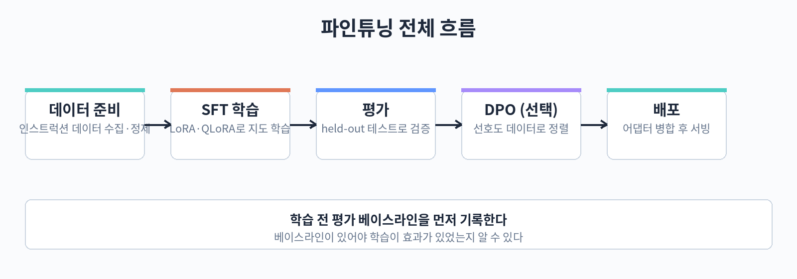

## 33. 학습 설정과 하이퍼파라미터

데이터와 LoRA 설정을 준비했다면 이제 실제로 학습을 돌릴 차례이다. 이 장에서는 TRL 라이브러리의 SFTTrainer로 학습 코드를 작성하고, 학습 결과를 좌우하는 하이퍼파라미터들의 의미를 설명한다. 마지막으로 파인튜닝 프레임워크들의 특징을 비교해 상황에 맞는 선택을 돕는다.



### TRL SFTTrainer 실습

TRL(Transformer Reinforcement Learning)은 Hugging Face에서 만든 학습용 라이브러리이다. 이름과 달리 SFT(지도 파인튜닝), DPO 같은 다양한 학습 방법을 지원한다. SFTTrainer는 인스트럭션 데이터로 지도 파인튜닝을 수행하는 클래스이다.

아래 코드는 31장에서 만든 train.jsonl과 valid.jsonl, 32장의 LoRA 설정을 이용해 학습하는 전체 예제이다.

```python
# train_sft.py — SFTTrainer로 LoRA 파인튜닝 실행
import torch
from datasets import load_dataset
from transformers import (
    AutoTokenizer,
    AutoModelForCausalLM,
    BitsAndBytesConfig,
    TrainingArguments,
)
from peft import LoraConfig, get_peft_model, prepare_model_for_kbit_training
from trl import SFTTrainer

MODEL_NAME = "google/gemma-2-9b-it"

tokenizer = AutoTokenizer.from_pretrained(MODEL_NAME)
if tokenizer.pad_token is None:
    tokenizer.pad_token = tokenizer.eos_token  # 패딩 토큰이 없으면 eos로 지정

bnb_config = BitsAndBytesConfig(
    load_in_4bit=True,
    bnb_4bit_quant_type="nf4",
    bnb_4bit_compute_dtype=torch.bfloat16,
    bnb_4bit_use_double_quant=True,
)
model = AutoModelForCausalLM.from_pretrained(
    MODEL_NAME, quantization_config=bnb_config, device_map="auto"
)
model = prepare_model_for_kbit_training(model)
model = get_peft_model(
    model,
    LoraConfig(
        r=16, lora_alpha=32, lora_dropout=0.05,
        target_modules=["q_proj", "k_proj", "v_proj", "o_proj",
                        "gate_proj", "up_proj", "down_proj"],
        task_type="CAUSAL_LM",
    ),
)

dataset = load_dataset("json", data_files={
    "train": "train.jsonl",
    "validation": "valid.jsonl",
})

def format_messages(ex):
    # messages 형식을 학습용 텍스트로 변환
    text = tokenizer.apply_chat_template(
        ex["messages"], tokenize=False, add_generation_prompt=False
    )
    return {"text": text}

dataset = dataset.map(format_messages)

args = TrainingArguments(
    output_dir="outputs/sft",
    num_train_epochs=3,
    per_device_train_batch_size=2,
    gradient_accumulation_steps=8,   # 실효 배치 크기 = 2 * 8 = 16
    learning_rate=2e-4,
    lr_scheduler_type="cosine",
    warmup_ratio=0.05,
    logging_steps=10,
    eval_strategy="epoch",           # 매 에폭 검증셋 평가
    save_strategy="epoch",
    bf16=True,
    optim="paged_adamw_8bit",        # QLoRA 권장 옵티마이저
    report_to="none",
)

trainer = SFTTrainer(
    model=model,
    args=args,
    train_dataset=dataset["train"],
    eval_dataset=dataset["validation"],
)
trainer.train()
trainer.save_model("outputs/sft-final")  # LoRA 어댑터 저장
```

학습이 끝나면 outputs/sft-final 폴더에 LoRA 어댑터 가중치만 저장된다. 베이스 모델 전체가 아니라 작은 어댑터 파일만 생기므로 저장 공간도 적게 든다.

### 하이퍼파라미터 이해하기

학습률(learning rate)은 가중치를 한 번에 얼마나 움직일지 정한다. LoRA 파인튜닝에서는 1e-4에서 2e-4 정도가 무난한 출발점이다. 너무 크면 학습이 불안정해지고, 너무 작으면 학습이 더디다. QLoRA에서는 양자화 때문에 2e-4처럼 조금 높은 값을 쓰는 경우가 많다.

에폭(epoch)은 전체 데이터를 몇 번 반복할지 정한다. 파인튜닝에서는 2~3 에폭이 일반적이다. 에폭을 늘리면 학습 데이터에 대한 적합도는 올라가지만 과적합 위험도 커진다. 검증 손실을 보면서 조정한다.

배치 크기(batch size)는 한 번의 업데이트에 사용하는 예제 수이다. GPU 메모리가 부족하면 per_device_train_batch_size를 작게 잡고 gradient_accumulation_steps로 보완한다. 그래디언트 어큐뮬레이션은 여러 미니 배치를 모았다가 한 번에 업데이트하는 기법으로, 실효 배치 크기는 두 값의 곱이 된다. 예제 코드에서는 2 곱하기 8로 실효 배치 16을 만들었다.

웜업(warmup)은 학습 초반에 학습률을 0에서 목표값까지 서서히 올리는 구간이다. 갑자기 큰 학습률로 시작하면 초반 업데이트가 불안정해질 수 있어, 전체 스텝의 5% 정도를 웜업에 할당하는 것이 일반적이다. lr_scheduler_type을 cosine으로 두면 학습 후반에 학습률이 부드럽게 감소해 마무리가 안정적이다.

아래 표는 자주 쓰는 값의 범위를 정리한 것이다.

| 하이퍼파라미터 | 권장 시작값 | 조정 방향 |
| learning rate | 2e-4 | 불안정하면 낮추고, 학습이 더디면 올린다 |
| num_train_epochs | 3 | 검증 손실이 오르면 줄인다 |
| 실효 배치 크기 | 16~32 | 메모리에 맞게 accumulation으로 조절 |
| warmup_ratio | 0.05 | 전체 스텝의 5% 내외 |
| lora r | 16 | 복잡한 작업은 32~64 시도 |

이 값들은 출발점일 뿐 정답이 아니다. 데이터 규모와 작업 난이도에 따라 달라지므로, 작은 설정으로 먼저 돌려보고 검증 손실 추이를 보면서 조정하는 것이 실무적인 접근이다.

### 프레임워크 선택

파인튜닝을 돕는 프레임워크가 여럿 있다. 각각의 특징을 알면 상황에 맞게 고를 수 있다.

PEFT는 Hugging Face의 파라미터 효율적 파인튜닝 라이브러리로, LoRA를 비롯한 어댑터 방법들의 표준 구현이다. TRL이나 transformers와 조합해 쓰는 기반 부품에 가깝다. 세밀한 제어가 필요할 때 선택한다.

Unsloth는 학습 속도와 메모리 효율을 극단적으로 최적화한 라이브러리이다. 같은 GPU에서 더 큰 배치로 더 빨리 학습할 수 있어 개인 GPU 사용자에게 인기가 많다. 지원하는 모델 종류가 계속 늘고 있지만, 최신 모델 지원 시점은 PEFT보다 늦을 수 있다.

Axolotl은 설정 파일(YAML) 하나로 파인튜닝 파이프라인 전체를 정의하는 도구이다. 다양한 모델과 학습 방법을 폭넓게 지원하고, 실험 관리가 편하다. 여러 설정을 비교하는 실험을 많이 할 때 좋다.

LLaMA-Factory는 웹 UI까지 제공하는 통합 파인튜닝 플랫폼이다. 코드 작성 없이도 학습을 돌릴 수 있어 입문자에게 친숙하다. SFT뿐 아니라 DPO 같은 정렬 학습도 지원한다.

torchtune은 PyTorch 팀이 만든 가벼운 파인튜닝 라이브러리이다. 최신 PyTorch 기능과의 궁합이 좋고, 코드가 간결해 학습 과정을 깊이 이해하고 싶은 사람에게 적합하다.

처음 시작한다면 PEFT와 TRL 조합으로 기본기를 익히고, 속도가 필요하면 Unsloth, 편한 실험 관리가 필요하면 Axolotl이나 LLaMA-Factory를 시도해 보는 순서를 권장한다.

### 체크포인트 관리와 학습 재개

학습이 길어지면 중간에 끊길 수 있다. 정전, 시간 제한, 실수로 인한 중단에 대비해 체크포인트를 남기는 것이 중요하다. TrainingArguments의 save_strategy를 epoch이나 steps로 두면 주기적으로 저장된다. save_total_limit으로 보관 개수를 제한하면 디스크가 꽉 차는 일을 막을 수 있다.

학습을 재개하려면 trainer.train 뒤에 resume_from_checkpoint를 지정한다.

```python
# 중단된 학습 이어서 하기
trainer.train(resume_from_checkpoint="outputs/sft/checkpoint-500")
```

체크포인트 폴더 이름은 스텝 번호를 포함하므로, 가장 최근 것을 고르면 된다. 옵티마이저 상태까지 저장되므로 이어서 학습해도 흐름이 끊기지 않는다.

### 흔한 에러와 대처

처음 학습을 돌리면 에러를 만나기 쉽다. 자주 나오는 것들을 정리한다.

CUDA out of memory가 뜨면 배치 크기를 줄이고 gradient_accumulation_steps를 늘린다. 그래도 부족하면 그래디언트 체크포인팅(gradient_checkpointing=True)을 켠다. 시퀀스 길이가 길다면 max_seq_length를 줄이는 것도 효과적이다.

토크나이저 패딩 에러는 pad_token이 없을 때 나온다. 예제 코드처럼 eos_token으로 지정하면 대부분 해결된다. 다만 패딩 토큰을 eos와 공유하면 라벨 마스킹에 주의해야 한다. TRL의 DataCollatorForCompletionOnlyLM을 쓰면 응답 부분만 학습하도록 지정할 수 있다.

학습 손실이 NaN으로 발산하면 학습률이 너무 높은 경우가 많다. 2e-4에서 시작했다면 1e-4나 5e-5로 낮춰 본다. QLoRA에서 bnb_4bit_compute_dtype을 float32로 올리면 안정성이 좋아지기도 한다.

### 학습 시간 어림잡기

학습 전에 대략의 소요 시간을 알면 일정 짜기가 편하다. 한 스텝의 시간은 GPU 성능, 모델 크기, 배치 크기에 따라 다르지만, 한 번 짧게 돌려 보면 어림할 수 있다. 예를 들어 100 스텝을 돌려 보고 걸린 시간을 재면, 전체 스텝 수로 비례 계산할 수 있다.

전체 스텝 수는 (데이터 수 나누기 실효 배치 크기) 곱하기 에폭으로 계산한다. 데이터 3,000개, 실효 배치 16, 에폭 3이면 약 563 스텝이다. 스텝당 10초라면 1시간 34분 정도이다. 실제로는 평가와 저장 시간이 추가되므로 여유를 둔다.

### 따라 하기: 학습 로그로 과적합 징후 읽기

학습이 끝나면 로그의 train loss와 eval loss를 비교한다. 아래 코드는 Trainer가 남긴 로그에서 두 값을 뽑아 간단히 출력하는 예제이다.

```python
# check_loss.py — 학습 로그에서 손실 추이 확인
import json

LOG_PATH = "outputs/sft/trainer_state.json"  # Trainer가 저장한 상태 파일

with open(LOG_PATH, encoding="utf-8") as f:
    state = json.load(f)

for entry in state["log_history"]:
    if "loss" in entry and "eval_loss" in entry:
        print(
            "스텝", entry["step"],
            "학습 손실:", round(entry["loss"], 4),
            "검증 손실:", round(entry["eval_loss"], 4),
        )
    elif "loss" in entry:
        print("스텝", entry["step"], "학습 손실:", round(entry["loss"], 4))
    elif "eval_loss" in entry:
        print("스텝", entry["step"], "검증 손실:", round(entry["eval_loss"], 4))
```

학습 손실은 계속 내려가는데 검증 손실이 어느 지점부터 올라가기 시작하면 과적합의 신호이다. 그 지점 이전의 체크포인트를 쓰는 것이 좋다. 35장에서 평가를 더 자세히 다룬다.

### 핵심 정리

- SFTTrainer는 인스트럭션 데이터로 지도 파인튜닝을 수행하는 TRL의 클래스로, LoRA 모델과 바로 연결해 쓸 수 있다.
- 학습률은 2e-4 내외, 에폭은 2~3, 실효 배치 크기는 16~32에서 시작해 검증 손실 추이를 보며 조정한다.
- 메모리가 부족하면 배치 크기를 줄이고 그래디언트 어큐뮬레이션으로 실효 배치를 맞춘다.
- PEFT+TRL은 기본기용, Unsloth는 속도용, Axolotl과 LLaMA-Factory는 실험 관리용, torchtune은 PyTorch 친화용으로 구분해 선택한다.
