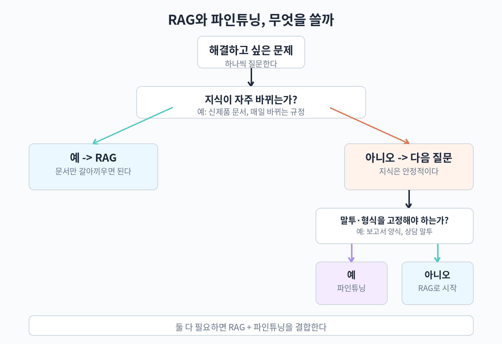

# Part 4. 선택과 실전

## 40. RAG와 파인튜닝, 언제 무엇을 쓸까

Part 1과 Part 2에서 검색 기반 접근법인 RAG를, Part 3에서 모델 자체를 바꾸는 파인튜닝을 배웠다. 실무에서 가장 자주 받는 질문은 두 기술 중 무엇을 선택해야 하느냐다. 이 장에서는 선택 기준을 비교표로 정리하고, 실제 의사결정이 어떤 흐름으로 진행되는지 살펴본 뒤, 두 기술을 함께 쓰는 방법까지 알아본다.

### 두 기술의 차이는 '지식을 어디에 넣는가'에서 시작한다

RAG와 파인튜닝은 겉으로 보기에는 비슷한 목표를 겨냥한다. 회사 문서에 없는 답변을 회사 문서에 맞게 내놓는 것, 고객 문의에 응대하는 말투로 대답하는 것, 오래된 정보를 새 정보로 바꾸는 것. 하지만 두 기술이 지식을 다루는 위치는 완전히 다르다.

RAG는 모델 바깥에 지식을 둔다. 문서를 벡터 데이터베이스에 저장해 두고, 질문이 들어올 때마다 관련 문서를 찾아 프롬프트에 붙여준다. 모델의 가중치는 변하지 않는다. 새로운 지식을 반영하고 싶으면 문서를 교체하거나 추가하면 되므로 업데이트가 가볍고 빠르다. 비유하자면 시험을 볼 때 참고서적을 펼쳐놓고 답을 찾는 방식에 가깝다.

파인튜닝은 모델 안쪽에 지식을 둔다. 학습 데이터를 통해 가중치를 조정한다. 학습이 끝나면 문서를 검색하지 않아도 모델이 알고 있는 것처럼 답한다. 하지만 지식이 가중치 속에 굳어지므로 나중에 바꾸고 싶으면 다시 학습해야 한다. 비유하자면 시험을 보기 전에 공부해서 외우는 방식이다.

두 방식을 섞어 쓰면 어떤가. 회사 FAQ 문서를 RAG로 검색하고, 응답 문체는 파인튜닝으로 학습한 것처럼, 실무에서는 둘을 함께 쓰는 경우가 많다. 어떤 경우에 어떤 조합이 좋은지는 뒤에서 정리한다.

### 비교 기준표로 한눈에 보기

기술 선택은 감이 아니라 기준으로 한다. 아래 표는 대표적인 일곱 가지 기준에서 RAG와 파인튜닝을 비교한 것이다. 자신의 요구사항이 어느 쪽에 가까운지 체크하면 답이 드러난다.

| 비교 기준 | RAG | 파인튜닝 |
|---|---|---|
| 지식 업데이트 빈도 | 문서만 교체하면 즉시 반영. 매일·매주 바뀌는 정보에 강함 | 바뀔 때마다 재학습 필요. 월 단위 이하의 느린 변경에 적합 |
| 출처 근거가 필요한가 | 검색한 문서를 그대로 보여줄 수 있어 근거 제시에 유리 | 모델이 외운 지식이므로 출처를 특정하기 어려움 |
| 환각 감소 효과 | 관련 문서를 함께 주므로 환각이 크게 줄어듦 | 말투와 형식을 학습해도 근거 없는 지식 생성이 완전히 사라지지는 않음 |
| 도메인 용어·말투 학습 | 검색 문서에 의존하므로 표현력이 제한적 | 인스트럭션 데이터로 특정 말투·형식·전문 용어 사용을 학습할 수 있음 |
| 필요한 데이터 | 검색 대상 문서 모음(문서만 있으면 됨) | 수천 건 이상의 인스트럭션 데이터, 선호도 데이터가 필요할 수 있음 |
| 초기 비용과 난이도 | 벡터 DB와 검색 파이프라인 구축으로 시작 가능 | 학습 인프라(GPU), 데이터 구축, 학습 튜닝이 필요해 진입 장벽이 높음 |
| 추론 시 지연과 비용 | 검색 단계가 추가되어 약간의 지연 발생 | 학습 후에는 추가 단계 없이 추론, 단 배포 인프라 준비 필요 |

표의 결론을 한 줄로 요약하면 이렇다. 지식이 자주 바뀌거나 근거를 보여줘야 하면 RAG를, 말투와 형식을 모델에게 몸에 익히게 하고 싶으면 파인튜닝을 고르는 것이 기본 원칙이다.

### 의사결정 흐름 따라가기

기준을 순서대로 물어보면서 선택을 좁혀가는 흐름을 살펴보자.

첫째, 답변의 근거를 사용자에게 보여줘야 하는가. 법률·의료·금융처럼 근거가 중요한 분야에서는 RAG가 거의 필수다. 검색된 문서를 함께 제시하면 답변의 신뢰도가 올라가고, 틀린 답이 나왔을 때도 어떤 문서가 잘못 쓰였는지 추적이 가능하다. 반면 내부 직원을 위한 빠른 도우미나 말투가 중요한 응대라면 파인튜닝 쪽으로 기운다.

둘째, 지식이 얼마나 자주 바뀌는가. 하루에도 바뀌는 상품 재고나 시세 정보라면 파인튜닝은 유지 비용이 너무 크다. 문서만 바꾸면 되는 RAG가 압도적으로 유리하다. 제품 매뉴얼처럼 분기 단위로 바뀌는 문서라면 두 방식 모두 가능하지만, 업데이트 부담은 여전히 RAG가 낮다.

셋째, 모델에게 가르치고 싶은 것이 지식인가, 아니면 행동인가. 여기서 행동이란 말투, 답변 형식, 특정 업무 절차를 말한다. 예를 들어 "코드 리뷰를 항상 세 가지 섹션(버그, 성능, 가독성)으로 나눠 작성해"라는 형식 요구는 RAG로 매번 프롬프트에 지침을 넣을 수도 있지만, 파인튜닝으로 학습시켜 두면 지침이 길어지지 않아 유지하기 편하다.

넷째, 학습용 데이터가 있는가. 파인튜닝은 양질의 데이터가 생명이다. 수백 건의 저품질 데이터로 학습하면 모델이 오히려 이상한 말투를 익힌다. 최소 수천 건의 좋은 인스트럭션 데이터가 없다면 파인튜닝은 시작하지 않는 것이 낫다. RAG는 검색할 문서만 있으면 되므로 데이터 장벽이 낮다.

다섯째, 비용과 인프라 제약은 어떤가. GPU 학습 자원이 없고 추론 API를 그대로 쓴다면 RAG가 현실적인 선택이다. 오픈소스 모델을 직접 운영하고 장기적으로 많이 호출할 계획이라면 파인튜닝 후 자사 모델을 서빙하는 것이 단위 비용에서 유리할 수 있다.

아래 흐름은 위의 다섯 단계 판단을 그림으로 옮긴 것이다.



### 함께 쓰는 경우: 실무의 정답은 종종 둘 다

RAG와 파인튜닝은 서로 배타적이지 않다. 실무에서 많이 쓰는 조합은 역할 분담이다. 지식과 근거는 RAG가 담당하고, 말투와 형식은 파인튜닝이 담당한다.

대표적인 사례를 보자. 사내 HR 챗봇을 만든다고 하자. 휴가 규정이나 복지 제도는 해마다 바뀌므로 문서 기반 RAG로 검색한다. 한편 챗봇의 응대 말투는 친절하고 간결한 사내 톤으로 정해져 있고, 답변 말미에는 관련 문의처를 고정 형식으로 붙인다. 이 말투와 형식을 파인튜닝으로 학습시키면 프롬프트가 짧아지고 일관성이 좋아진다. 지식은 바뀌지만 말투는 잘 바뀌지 않으므로, 이 분업은 유지 비용 측면에서도 합리적이다.

또 다른 사례는 검색 품질이 낮은 분야다. 법률 문서처럼 용어가 특수하고 긴 문서가 많은 경우, 임베딩만으로는 검색 정확도가 부족할 수 있다. 이때 도메인 문서로 파인튜닝한 임베딩 모델이나 생성 모델을 쓰면 검색과 생성 모두에서 품질이 올라간다. Part 2의 하이브리드 검색, 리랭킹과 함께 고려할 수 있는 카드다.

세 번째 사례는 비용 최적화다. 매번 긴 지침 프롬프트를 붙여 호출하면 토큰 비용이 쌓인다. 자주 쓰는 지침과 형식을 파인튜닝으로 모델에 넣어두면 프롬프트가 짧아져 호출당 비용이 줄어든다. 호출량이 많은 서비스에서는 학습에 한 번 투자하고 추론 비용을 낮추는 계산이 성립한다. 물론 호출량이 적다면 파인튜닝 학습 비용을 회수하지 못하므로, 예상 호출량으로 손익을 따져봐야 한다.

주의할 점도 있다. 둘을 함께 쓰면 시스템 복잡도가 올라가고, 문제가 생겼을 때 원인이 검색 때문인지 모델 때문인지 가려내야 한다. 23장에서 배운 검색과 생성 분리 측정의 원칙이 여기서 다시 중요해진다. 문제가 생기면 검색 품질과 생성 품질을 따로 재고, 어느 쪽을 고칠지 판단한다. 또한 파인튜닝된 모델 위에 RAG를 얹으면, 모델이 학습 때 외운 낡은 지식과 검색된 새 문서가 충돌할 수 있다. 프롬프트에 "검색된 문서를 우선하라"는 지침을 명시하고, 충돌 사례를 평가셋에 포함시켜 모니터링한다.

### 선택을 어렵게 만드는 흔한 착각 세 가지

첫째, "파인튜닝하면 환각이 사라진다"는 착각이다. 파인튜닝은 말투와 형식을 잘 학습하지만, 모델이 모르는 사실을 지어내는 습관 자체를 없애주지는 않는다. 최신 지식을 외우게 하려고 파인튜닝을 하면 오히려 낡은 지식을 확신에 차서 말하는 모델이 된다. 사실 정확성이 목표라면 RAG가 정답에 가깝다.

둘째, "RAG면 데이터가 필요 없다"는 착각이다. RAG도 문서 품질 관리라는 데이터 작업이 있다. 오래된 문서 정리, 메타데이터 기록, 평가셋 구축은 모두 사람의 손이 간다. 문서만 던져 넣으면 된다고 생각하면 검색 품질이 무너진다. RAG의 데이터 작업은 파인튜닝보다 가볍지만, 없는 것은 아니다.

셋째, "둘 중 하나만 골라야 한다"는 착각이다. 앞에서 본 것처럼 실무에서는 분업이 일반적이다. 선택의 질문은 "어느 하나"가 아니라 "어느 것을 먼저, 어느 정도로"다. 보통은 RAG부터 구축하고 측정으로 부족한 지점을 찾은 뒤, 그 지점이 말투와 형식의 문제라면 파인튜닝을 추가하는 순서가 안전하다.

### 따라 하기 실습: 요구사항을 점수화해 보기

개념은 알겠는데 실제로 적용이 어렵다면, 요구사항을 점수로 바꿔보는 방법이 도움이 된다. 아래 코드는 일곱 가지 기준에 가중치를 곱해 RAG와 파인튜닝 중 어느 쪽에 점수가 높은지 계산하는 간단한 스크립트다. 실제 프로젝트 킥오프 회의에서 팀원과 기준을 합의하는 용도로 쓸 수 있다.

```python
# decision_score.py
# 요구사항을 점수화해 RAG와 파인튜닝 중 어느 쪽에 가까운지 확인한다.
# 각 기준은 0~10점으로 입력한다. 점수가 높을수록 해당 기술이 유리한 상황이다.

criteria = [
    ("knowledge_update_freq", 9, "지식 업데이트 빈도가 높음"),
    ("citation_needed", 8, "출처 근거 제시 필요"),
    ("tone_format_control", 7, "말투/형식 학습 필요"),
    ("data_available", 4, "양질 인스트럭션 데이터 보유"),
    ("infra_budget", 5, "학습 인프라와 예산 여유"),
    ("low_latency_needed", 6, "낮은 추론 지연 필요"),
    ("fact_critical", 9, "정확한 사실 답변 중요"),
]

# 기준별로 RAG에 유리한지(+), 파인튜닝에 유리한지(-) 방향을 정한다
direction = {
    "knowledge_update_freq": +1,
    "citation_needed": +1,
    "tone_format_control": -1,
    "data_available": -1,
    "infra_budget": -1,
    "low_latency_needed": -1,
    "fact_critical": +1,
}

rag_score = 0
ft_score = 0
for key, score, desc in criteria:
    if direction[key] > 0:
        rag_score += score
    else:
        ft_score += score
    print(f"{desc}: {score}점")

print(f"\nRAG 총점: {rag_score}")
print(f"파인튜닝 총점: {ft_score}")
if rag_score > ft_score:
    print("결론: RAG 중심으로 설계하고, 필요시 파인튜닝 보조를 검토")
elif ft_score > rag_score:
    print("결론: 파인튜닝 중심으로 설계하고, 최신 지식은 RAG로 보완")
else:
    print("결론: 두 기술을 함께 쓰는 하이브리드 설계를 검토")
```

이 스크립트의 결과 자체보다 중요한 것은 팀이 기준에 점수를 매기며 같은 언어로 논의하게 된다는 점이다. "우리 요구사항이 RAG에 60점, 파인튜닝에 40점이다"라는 말은 "RAG가 좋을 것 같다"보다 훨씬 구체적인 합의가 된다.

### 두 가지 가상 시나리오로 선택 연습하기

이론을 실제로 적용해보는 연습을 두 가지 시나리오로 해보자.

시나리오 A: 쇼핑몰 상품 문의 챗봇. 상품 정보는 매일 바뀌고(재고, 가격, 신상품), 답변에는 상품 페이지 링크를 근거로 붙여야 한다. 고객이 "이 상품 지금 재고 있어요"라고 물으면 어제 정보가 아니라 오늘 정보로 답해야 한다. 선택: RAG. 지식이 매일 바뀌고 근거 제시가 필수이므로 파인튜닝은 유지 비용이 맞지 않는다. 검색 대상은 상품 DB이므로 벡터 검색과 함께 상품명 키워드 검색(BM25)을 병행하는 하이브리드 구성이 어울린다.

시나리오 B: 코드 리뷰 어시스턴트. 회사의 코딩 컨벤션이 정해져 있고, 리뷰 코멘트는 항상 "문제점, 제안, 예시 코드"라는 고정 형식을 따른다. 컨벤션은 1년에 한두 번 바뀌고, 근거 문서를 보여줄 필요는 없다. 대신 수천 건의 과거 리뷰 코멘트 데이터가 있다. 선택: 파인튜닝. 가르칠 대상이 지식보다 행동(형식과 말투)이고, 좋은 학습 데이터가 있으며, 지식 변경이 느리다. 최신 라이브러리 정보가 필요하면 RAG로 보완할 수 있다.

두 시나리오를 표로 정리하면 다음과 같다.

| 항목 | 시나리오 A (쇼핑몰 챗봇) | 시나리오 B (코드 리뷰) |
|---|---|---|
| 지식 변경 빈도 | 매일 | 연 1~2회 |
| 근거 제시 필요 | 필수 (상품 링크) | 불필요 |
| 가르칠 대상 | 최신 상품 지식 | 리뷰 형식과 말투 |
| 학습 데이터 | 없음 (상품 DB만 있음) | 과거 리뷰 수천 건 |
| 선택 | RAG + 하이브리드 검색 | 파인튜닝 (+ 필요시 RAG) |

이 연습을 자신의 프로젝트에 적용해보자. 위 표의 다섯 행을 자신의 요구사항으로 채워보면 선택이 자연스럽게 드러난다. 40장의 실습 스크립트와 함께 쓰면 팀 논의 자료로도 쓸 수 있다.

### 선택 후에도 남는 질문들

선택이 끝났다고 고민이 끝나는 것은 아니다. 자주 나오는 후속 질문을 정리한다.

"RAG로 시작했다가 나중에 파인튜닝을 추가할 수 있는가." 가능하다. 오히려 권장되는 순서다. RAG 파이프라인과 평가셋을 먼저 갖추면, 파인튜닝을 추가했을 때 품질이 올랐는지 측정으로 확인할 수 있다. 평가셋 없이 파인튜닝을 추가하면 좋아졌는지 알 수 없다.

"파인튜닝한 모델에 RAG를 얹으면 충돌하지 않는가." 충돌할 수 있다. 모델이 학습 때 외운 낡은 지식과 검색된 새 문서가 다를 때다. 프롬프트에 "검색된 문서를 우선하라"는 지침을 넣고, 충돌 사례를 평가셋에 포함시켜 모니터링한다. 심한 경우 파인튜닝 데이터에서 시의성 있는 지식을 빼고 말투와 형식만 남기는 방법도 있다.

"오픈소스 모델과 상용 API 중 무엇을 써야 하는가." RAG라면 상용 API로 시작하는 것이 빠르다. 검색 파이프라인에 집중할 수 있기 때문이다. 파인튜닝이라면 오픈소스 모델이 전제조건에 가깝다. 상용 API의 파인튜닝 상품도 있지만 비용과 데이터 통제 측면에서 따져봐야 한다. 호출량이 많아지면 오픈소스 자가 서빙의 단위 비용이 유리해지는 지점이 온다.

### 핵심 정리

- RAG는 모델 바깥에 지식을 두고 문서로 업데이트하고, 파인튜닝은 모델 안쪽 가중치에 지식을 넣어 학습으로 업데이트한다.
- 근거 제시가 필요하거나 지식이 자주 바뀌면 RAG가, 말투와 형식을 학습시키고 싶으면 파인튜닝이 기본 선택이다.
- 의사결정은 다섯 단계로 좁힌다: 근거 필요 여부, 지식 변경 빈도, 가르칠 대상(지식 vs 행동), 데이터 보유 여부, 비용과 인프라.
- 실무에서는 역할 분담이 일반적이다: 지식과 근거는 RAG, 말투와 형식은 파인튜닝.
- 요구사항을 점수화하면 팀이 같은 기준으로 합의할 수 있어 선택의 근거가 명확해진다.
